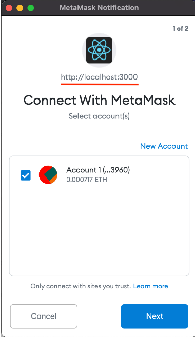
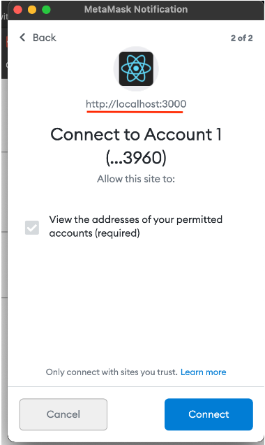
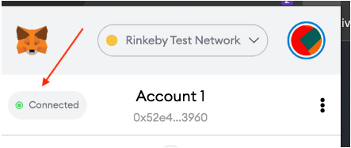

#   100. Required Update for Web3 and Metamask Permissions

In the upcoming lecture, we will be creating a web3 module to connect with Metamask in our client application.

The code used in the lecture has since been fully deprecated. Some of the fixes mentioned using ethereum.enable() have also now been deprecated:

https://docs.metamask.io/guide/ethereum-provider.html#legacy-methods

The **web3.js** module will need to be updated to include the current method for requesting access to Metamask:

```
import Web3 from "web3";
 
window.ethereum.request({ method: "eth_requestAccounts" });
 
const web3 = new Web3(window.ethereum);
 
export default web3;
```

After adding the console.log to your src/App.js and reloading your browser, Metamask should immediately launch a popup requesting access.

Ensure that the application requesting access is coming from **localhost:3000** and click the **Next** button.

<p align="center" ></p> 

On the next screen, click the **Connect** button:

<p align="center" ></p> 

You should now see **Connected** with a **green circle** to the left.

<p align="center" ></p> 

After authorizing the application running on localhost:3000 to connect with Metamask, you should now be able to view the address in the browser console.