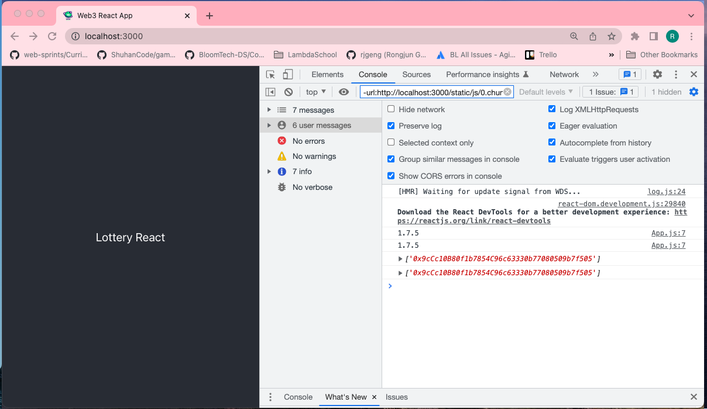

# 102. Web3 Setup

**Solution: BREAKING CHANGE: webpack < 5 used to include polyfills for node.js core modules by default....**

Open the lottery-react project's package.json file in a code editor and change this line:

    ```
    "react-scripts": "^5.0.0",
    ```

to this:

    ```
    "react-scripts": "4.0.3",
    ```

Then, using your terminal, change into the root of the lottery-react project directory and run the following:

    ```
    rm -r node_modules
    rm package-lock.json
    ```

    ```
    npm install
    ```

**Install web3**
```
npm install web3
```

**web3.js**
```
import Web3 from "web3";

window.ethereum.request({ method: "eth_requestAccounts" });

const web3 = new Web3(window.ethereum);

export default web3;

/*
import Web3 from 'web3';
const web3 = new Web3(window.web3.currentProvider);
export default web3;
*/
```

**app.js**
```
import "./App.css";
import React from "react";
import web3 from './web3';
 
class App extends React.Component {
  render() {
    console.log(web3.version)
    web3.eth.getAccounts().then(console.log);
    return (
      <div className="App">
        <header className="App-header">
          
          Lottery React
         
        </header>
      </div>
    );
  }
}
export default App;
```

**npm run start**
```
npm run start
```

<details>
  <summary>Web3 Setup - result</summary>


---  

## **How to Polyfill node core modules in webpack 5**

In the upcoming lecture, after adding the web3 imports to your application, you may receive the following error:

BREAKING CHANGE: webpack < 5 used to include polyfills for node.js core modules by default....

**Solution:**

- [How to setup Web3](../How-to-setup-Web3.md)

**Until CRA either [provides a workaround](https://github.com/facebook/create-react-app/pull/11764) (there is a current pull request) to avoid ejecting, or, web3 somehow addresses this, I would recommend the following:**

Open the lottery-react project's package.json file in a code editor and change this line:

    ```
    "react-scripts": "^5.0.0",
    ```

to this:

    ```
    "react-scripts": "4.0.3",
    ```

Then, using your terminal, change into the root of the lottery-react project directory and run the following:

    ```
    rm -r node_modules
    rm package-lock.json
    npm install
    ```

- [digital envelope routines::initialization error](https://stackoverflow.com/questions/69665222/node-js-17-0-1-gatsby-error-digital-envelope-routinesunsupported-err-os)
- [101. BREAKING CHANGE: webpack < 5 used to include polyfills for node.js core modules](101_BREAKING-CHANGE_webpack-%3C-5-used-to-include-polyfills-for-nodejs-core-modules.md)
- [How to Polyfill node core modules in webpack 5](https://stackoverflow.com/questions/64557638/how-to-polyfill-node-core-modules-in-webpack-5)

##  You are accessing the MetaMask window.web3.currentProvider shim

This property is deprecated; use window.ethereum instead. For details, see: https://docs.metamask.io/guide/provider-migration.html#replacing-window-web3

```
import Web3 from 'web3';
const web3 = new Web3(window.web3.currentProvider);
export default web3;
```

to 

```
import Web3 from "web3";
window.ethereum.request({ method: "eth_requestAccounts" }); 
const web3 = new Web3(window.ethereum); 
export default web3;
```

- [100. Required Update for Web3 and Metamask Permissions](100_Required-Update-for-Web3-and-Metamask-Permissions.md)
---
</details>  

##  Resources for this lecture

---

-   [104-web3-setup.zip](https://github.com/web3-nfts/bt-web3/raw/main/Curricula/Ethereum-and-Solidity_The_Complete_Developers_Guide/resources/104-web3-setup.zip)
