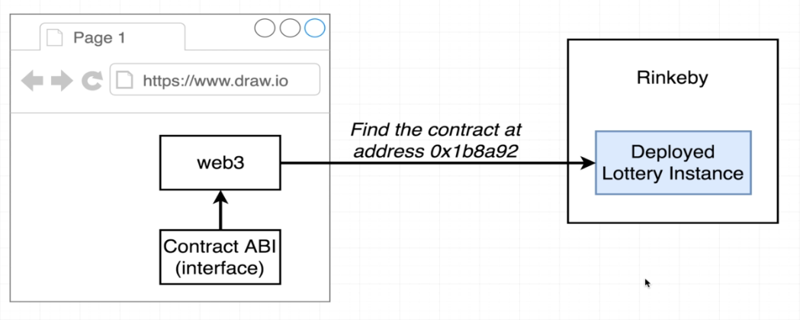

# 103. Deploying the Lottery Contract


---

**Add `console.log(interface)` inside lottery - deploy.js**
```
const HDWalletProvider = require('@truffle/hdwallet-provider');
const Web3 = require('web3');
const { interface, bytecode } = require('./compile');
const { metamaskSRP } = require('./secret')

const provider = new HDWalletProvider(
  metamaskSRP,
  // remember to change this to your own phrase!
  'https://rinkeby.infura.io/v3/00f0c438b0dc4848bc99f00b971b0a7c'
  // remember to change this to your own endpoint!
);
const web3 = new Web3(provider);

const deploy = async () => {
  const accounts = await web3.eth.getAccounts();

  console.log('Attempting to deploy from account', accounts[0]);

  const result = await new web3.eth.Contract(JSON.parse(interface))
    .deploy({ data: bytecode })
    .send({ gas: '1000000', from: accounts[0] });

  console.log(interface);  // log out interface
  console.log('Contract deployed to', result.options.address);
  provider.engine.stop();
};
deploy();

```

##  Resources for this lecture

---

-   [106-deploying-Lottery-React.zip](https://github.com/web3-nfts/bt-web3/raw/main/Curricula/Ethereum-and-Solidity_The_Complete_Developers_Guide/resources/106-deploying-Lottery-React.zip)

---

-   [106-deploying-Lottery.zip](https://github.com/web3-nfts/bt-web3/raw/main/Curricula/Ethereum-and-Solidity_The_Complete_Developers_Guide/resources/106-deploying-Lottery.zip)

