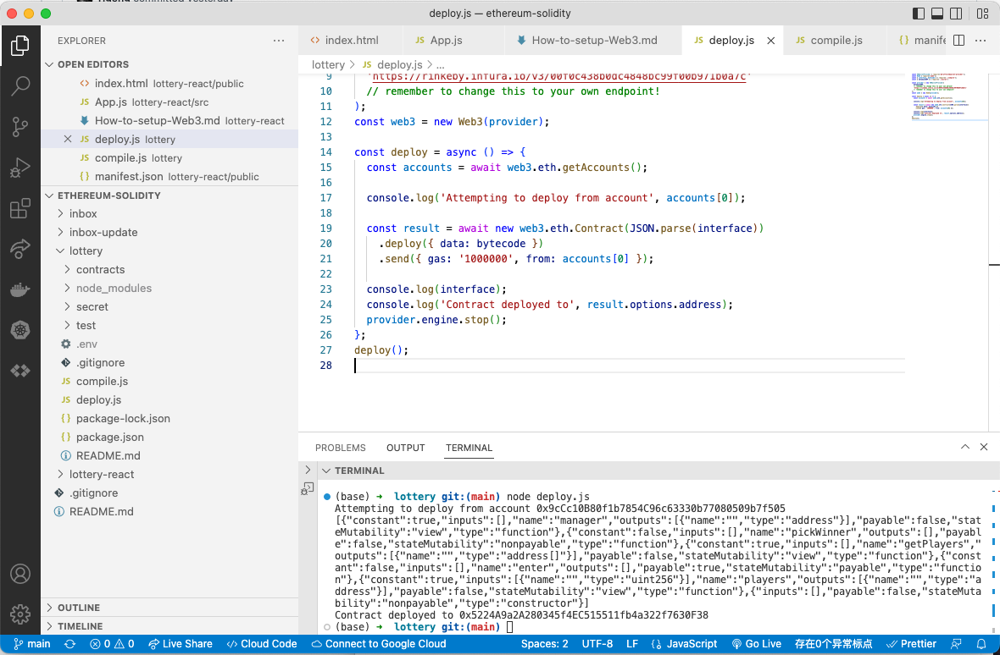

# 104. Local Contract Instances

**Deployment to Rinkeby** 

-   Deployment to Rinkeby 
    ```
    node deploy.js
    ```  

<details>
  <summary>Deployment to Rinkeby</summary>

    ```
    node deploy.js
    ```  


---

**ABI**
```
[{"constant":true,"inputs":[],"name":"manager","outputs":[{"name":"","type":"address"}],"payable":false,"stateMutability":"view","type":"function"},{"constant":false,"inputs":[],"name":"pickWinner","outputs":[],"payable":false,"stateMutability":"nonpayable","type":"function"},{"constant":true,"inputs":[],"name":"getPlayers","outputs":[{"name":"","type":"address[]"}],"payable":false,"stateMutability":"view","type":"function"},{"constant":false,"inputs":[],"name":"enter","outputs":[],"payable":true,"stateMutability":"payable","type":"function"},{"constant":true,"inputs":[{"name":"","type":"uint256"}],"name":"players","outputs":[{"name":"","type":"address"}],"payable":false,"stateMutability":"view","type":"function"},{"inputs":[],"payable":false,"stateMutability":"nonpayable","type":"constructor"}]
```

**Address deployed to**
```
0x5224A9a2A280345f4EC515511fb4a322f7630F38
```
</details>  

**Create `lottery-react/src/lottery.js`**
```
import web3 from './web3';

const address = '0x5224A9a2A280345f4EC515511fb4a322f7630F38';

const abi = [
    {
        "constant":true,
        "inputs":[],
        "name":"manager",
        "outputs":[{"name":"","type":"address"}],
        "payable":false,
        "stateMutability":"view",
        "type":"function"
    },
    {
        "constant":false,
        "inputs":[],
        "name":"pickWinner",
        "outputs":[],
        "payable":false,
        "stateMutability":"nonpayable",
        "type":"function"
    },
    {
        "constant":true,
        "inputs":[],
        "name":"getPlayers",
        "outputs":[{"name":"","type":"address[]"}],
        "payable":false,
        "stateMutability":"view",
        "type":"function"
    },
    {
        "constant":false,
        "inputs":[],
        "name":"enter",
        "outputs":[],
        "payable":true,
        "stateMutability":"payable",
        "type":"function"
    },
    {
        "constant":true,
        "inputs":[{"name":"","type":"uint256"}],
        "name":"players",
        "outputs":[{"name":"","type":"address"}],
        "payable":false,
        "stateMutability":"view",
        "type":"function"},
    {
        "inputs":[],
        "payable":false,
        "stateMutability":"nonpayable",
        "type":"constructor"
    }
];

export default new web3.eth.Contract(abi, address);

```

##  Resources for this lecture

---

-   [107-local-contract.zip](https://github.com/web3-nfts/bt-web3/raw/main/Curricula/Ethereum-and-Solidity_The_Complete_Developers_Guide/resources/107-local-contract.zip)