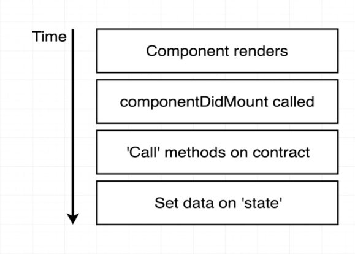

#   105. Rendering Contract Data



**`App.js`** -Rendering Contract Data
```
import "./App.css";
import React from "react";
import web3 from './web3';
import lottery from "./lottery";
 
class App extends React.Component {
  constructor (props) {
    super(props);

    this.state = { manager: ''};
  }

  async componentDidMount(){
    const manager = await lottery.methods.manager().call();

    this.setState({ manager });
  }

  render() {    
    return (
      <div>
        <h2>Lottery Contract</h2>
        <p>This contract is managed by {this.state.manager}</p>
      </div>
    );
  }
}
export default App;
```

##  Resources for this lecture

---

-   [108-rendering.zip](https://github.com/web3-nfts/bt-web3/raw/main/Curricula/Ethereum-and-Solidity_The_Complete_Developers_Guide/resources/108-rendering.zip)