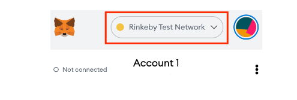
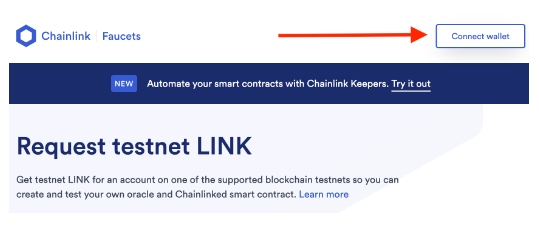
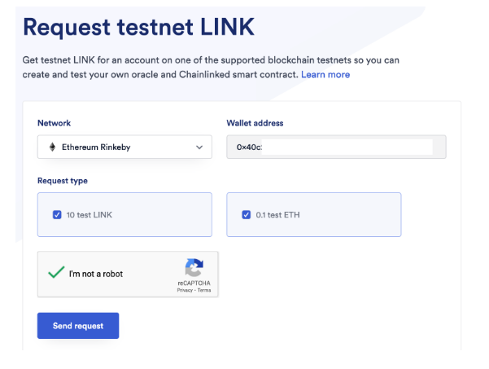

#   10. A Note About the Faucet

In the upcoming lecture, we will be heading to https://rinkeby-faucet.com for a quick demo to receive .001 Ether.

This particular faucet sources Ether from the official [Rinkeby Authenticated Faucet](https://faucet.rinkeby.io/). Due to the very high demand and interest in Ethereum, the official faucet will frequently stop funding requests. Once this occurs our demo faucet will quickly run out of Ether and you may receive an **Insufficient Funds** error.

**If you encounter any errors please use the following faucet instead:**

https://faucets.chain.link/rinkeby

1.  Make sure you are signed into Metamask in your browser, and the Rinkeby Test Network is selected:

 

2.  Temporarily disable any other wallet extensions you may have running in the browser (such as the Coinbase wallet). These wallets will cause a conflict with Metamask when trying to obtain funds.

3.  Click the **Connect wallet** button in the top right corner of the page:

4.  Check the **I'm not a robot** verification

5.  Click **Send request** (Important - You'll probably want to make three requests to get at least **0.3 Ether** to use in the course. You can always come back for more if you need)

 

**Important** - while the ChainLink faucet is very stable it also does suffer outages from time to time. You can also try the following Alchemy faucet:

https://rinkebyfaucet.com/

---

- [10. A Note About the Faucet](https://www.udemy.com/course/ethereum-and-solidity-the-complete-developers-guide/learn/lecture/25992414#learning-tools)