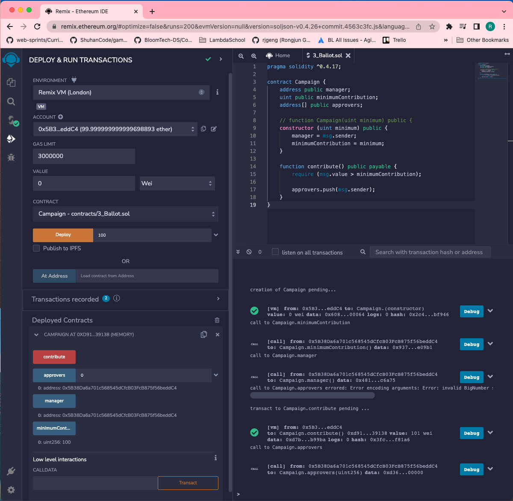

# 120. A Quick Test

**Campaign.sol** - Contributing to the Campaign
```
pragma solidity ^0.4.17;

contract Campaign {
    address public manager;
    uint public minimumContribution;
    address[] public approvers;

    // function Campaign(uint minimum) public {
    constructor (uint minimum) public {    
        manager = msg.sender;
        minimumContribution = minimum;
    }

    function contribute() public payable {
        require (msg.value > minimumContribution);

        approvers.push(msg.sender);
    }
}
```

<details>
  <summary>A Quick Test - remix</summary>



---
</details>  

##  Resources for this lecture

---

-   [118-quick-test.zip](https://github.com/web3-nfts/bt-web3/raw/main/Curricula/Ethereum-and-Solidity_The_Complete_Developers_Guide/resources/118-quick-test.zip)