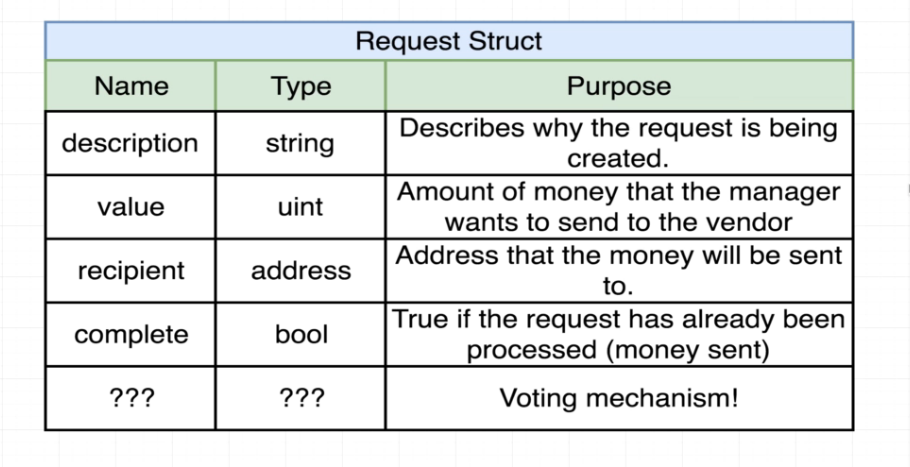

#   121. The Request Struct

**Campaign.sol** - The Request Struct
```
pragma solidity ^0.4.17;

contract Campaign {
    struct Request {
        string description;
        uint value;
        address recipient;
        bool complete;
    }

    address public manager;
    uint public minimumContribution;
    address[] public approvers;

    // function Campaign(uint minimum) public {
    constructor (uint minimum) public {    
        manager = msg.sender;
        minimumContribution = minimum;
    }

    function contribute() public payable {
        require (msg.value > minimumContribution);

        approvers.push(msg.sender);
    }
}
```


---

---