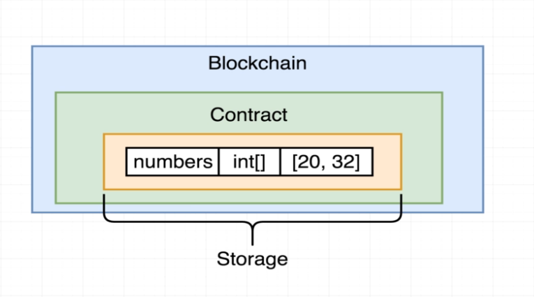
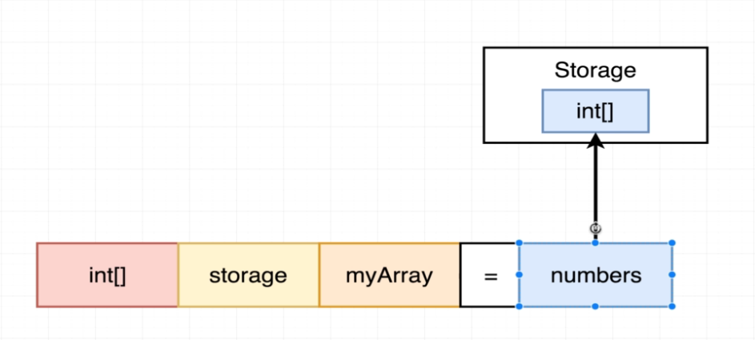
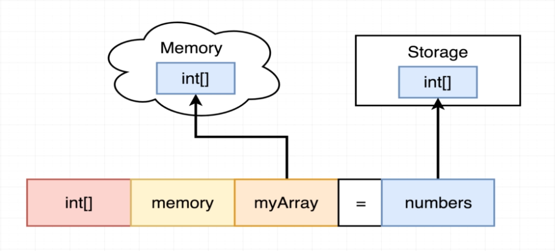

# 126. More on Storage vs Memory

**Campaign.sol** 
```
pragma solidity ^0.4.17;

contract Campaign {
    struct Request {
        string description;
        uint value;
        address recipient;
        bool complete;
    }

    Request [] public requests;
    address public manager;
    uint public minimumContribution;
    address[] public approvers;

    modifier restricted() {
        require(msg.sender == manager);
        _;
    }

    constructor (uint minimum) public {    
        manager = msg.sender;
        minimumContribution = minimum;
    }

    function contribute() public payable {
        require (msg.value > minimumContribution);

        approvers.push(msg.sender);
    }

    function createRequest(string description, uint value, address recipient) public restricted {
        Request memory newRequest = Request ({
            description: description,
            value: value,
            recipient: recipient,
            complete: false
            
        });

        // Request(description, value, recipient, false);

        requests.push(newRequest) ;
    }
}
```


---

---

---

<details>
  <summary>Compile issues and More on Storage vs Memory</summary>


---
**contracts/3_Ballot.sol:10:5: Warning:**
```
contracts/3_Ballot.sol:10:5: Warning: Variable is declared as a storage pointer. Use an explicit "storage" keyword to silence this warning.
int[] myArray = numbers;
^-----------^
```
---
**contracts/3_Ballot.sol:10:5: Warning:**
```
contracts/3_Ballot.sol:10:5: Warning: Unused local variable.
int[] myArray = numbers;
^-----------^
```

## More on Storage vs Memory

**Numbers.sol** - More on Storage vs Memory
```
pragma solidity ^0.4.17;

contract Numbers {
    int[] public numbers;

    constructor () public {
        numbers.push(20);
        numbers.push(32);    

    // int[] storage myArray = numbers;
    int[] memory myArray = numbers;
    myArray [0] = 1;
    
    }
}        
```

**Numbers.sol** - More on Storage vs Memory: pure (or memory)
```
pragma solidity ^0.4.17;

contract Numbers {
    int[] public numbers;

    constructor () public {
        numbers.push(20);
        numbers.push(32);   

        changeArray(numbers);
    }

    function changeArray(int[] myArray) private pure {
    // function changeArray(int[] memory myArray) private pure {
        myArray[0] = 1;
    }
}     
```

**Numbers.sol** - More on Storage vs Memory: storage 
```
pragma solidity ^0.4.17;

contract Numbers {
    int[] public numbers;

    constructor () public {
        numbers.push(20);
        numbers.push(32);   

        changeArray(numbers);
    }

    function changeArray(int[] storage myArray) private  {
        myArray[0] = 1;
    }
}     
```

- [What does the keyword "memory" do exactly?](https://ethereum.stackexchange.com/questions/1701/what-does-the-keyword-memory-do-exactly)
</details>  