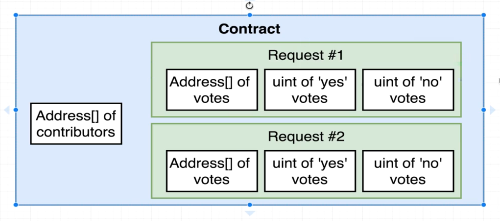
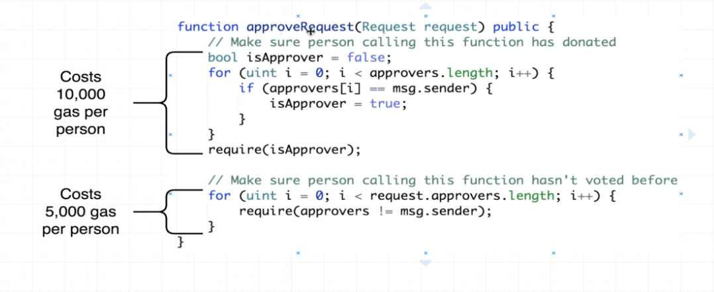

# 128. The Wrong Voting System

**Campaign.sol** - The Wrong Voting System
```
pragma solidity ^0.4.17;

contract Campaign { 
    function approveRequest(Request request) public {
        //  Make sure person calling this function has donated
        bool isApprover = false;
        for (unit i = 0; i < approvers.length; i++) {
            if (approvers[i] == mag.sender) {
                isApprover = true;
            }
        }
        require(isApprover);

        //  Make sure person calling this function hasn't voted before
        for (unit i = 0; i < request.approvers.length; i++) {
            require(request.approvers[i] != mag.sender);  
        }
    }
}
```


---

---