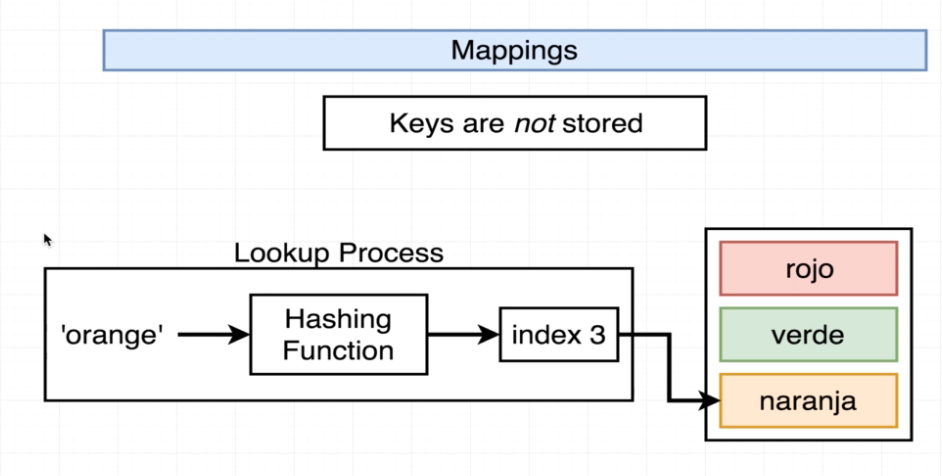
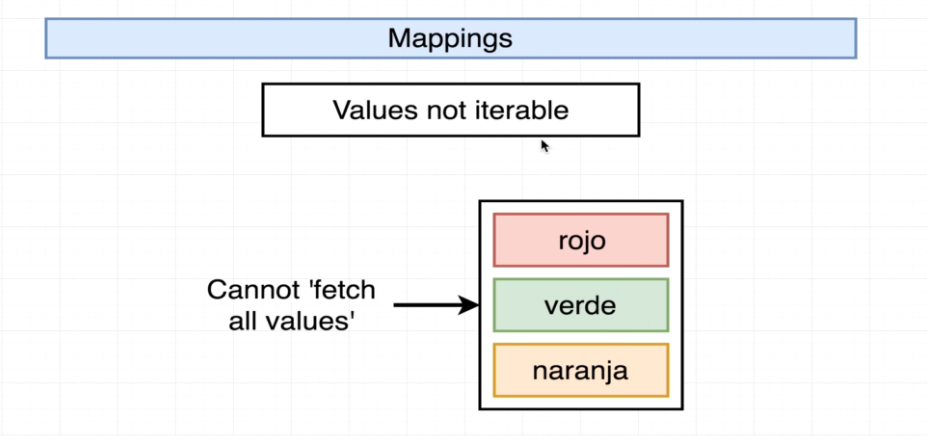
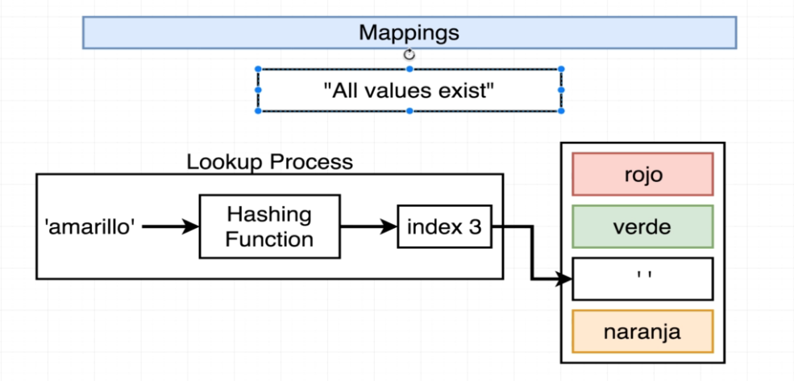

# 131. Basics of Mappings

**JSPlaygrounds**
```
const spanishColors = {
	red: 'rojo',
	green: 'verde',
    orange: 'naranja'
};

Object.keys(spanishColors);
Object.values(spanishColors);
spanishColors['red']
```


---

---

---


-   [https://stephengrider.github.io/JSPlaygrounds](https://stephengrider.github.io/JSPlaygrounds)
    - [https://github.com/ShuhanCode/JSPlaygrounds](https://github.com/ShuhanCode/JSPlaygrounds)

