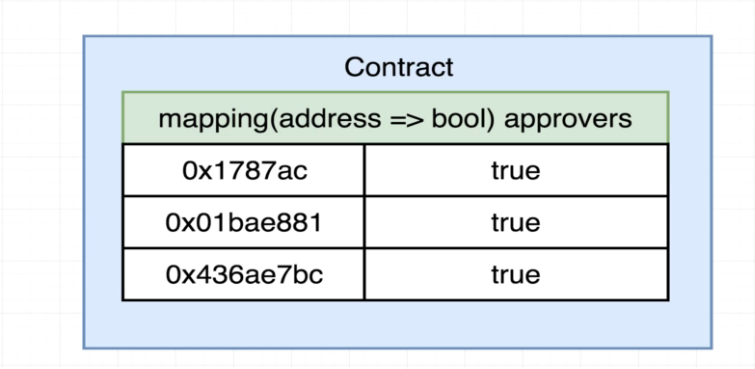

# 132. Refactoring to Mappings

**Campaign.sol** - Refactoring to Mappings
```
pragma solidity ^0.4.17;

contract Campaign {
    struct Request {
        string description;
        uint value;
        address recipient;
        bool complete;
    }

    Request [] public requests;
    address public manager;
    uint public minimumContribution;
    mapping(address => bool) public approvers;

    modifier restricted() {
        require(msg.sender == manager);
        _;
    }

    constructor (uint minimum) public {    
        manager = msg.sender;
        minimumContribution = minimum;
    }

    function contribute() public payable {
        require (msg.value > minimumContribution);

        approvers[msg.sender] = true;
    }

    function createRequest(string description, uint value, address recipient) public restricted {
        Request memory newRequest = Request ({
            description: description,
            value: value,
            recipient: recipient,
            complete: false
            
        });

        requests.push(newRequest) ;
    }
}
```


---