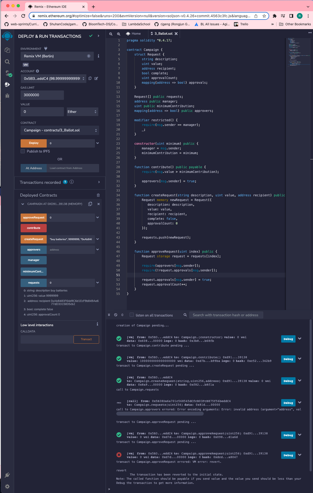

# 136. Testing Request Approvals

**Campaign.sol** - Testing Request Approvals
```
pragma solidity ^0.4.17;

contract Campaign {
    struct Request {
        string description;
        uint value;
        address recipient;
        bool complete;
        uint approvalCount;
        mapping(address => bool) approvals;
    }

    Request[] public requests;
    address public manager;
    uint public minimumContribution;
    mapping(address => bool) public approvers;

    modifier restricted() {
        require(msg.sender == manager);
        _;
    }

    constructor(uint minimum) public {
        manager = msg.sender;
        minimumContribution = minimum;
    }

    function contribute() public payable {
        require(msg.value > minimumContribution);

        approvers[msg.sender] = true;
    }

    function createRequest(string description, uint value, address recipient) public restricted {
        Request memory newRequest = Request({
           description: description,
           value: value,
           recipient: recipient,
           complete: false,
           approvalCount: 0
        });

        requests.push(newRequest);
    }

    function approveRequest(uint index) public {
        Request storage request = requests[index];

        require(approvers[msg.sender]);
        require(!request.approvals[msg.sender]);

        request.approvals[msg.sender] = true;
        request.approvalCount++;
    }
}
```

<details>
  <summary>Testing Request Approvals - result</summary>


---
</details>  


##  Resources for this lecture

---

-   [134-testing-approvals.zip](https://github.com/web3-nfts/bt-web3/raw/main/Curricula/Ethereum-and-Solidity_The_Complete_Developers_Guide/resources/134-testing-approvals.zip)