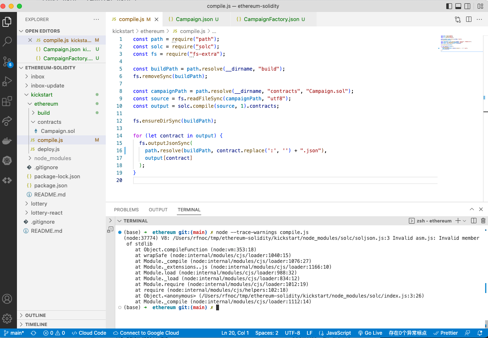
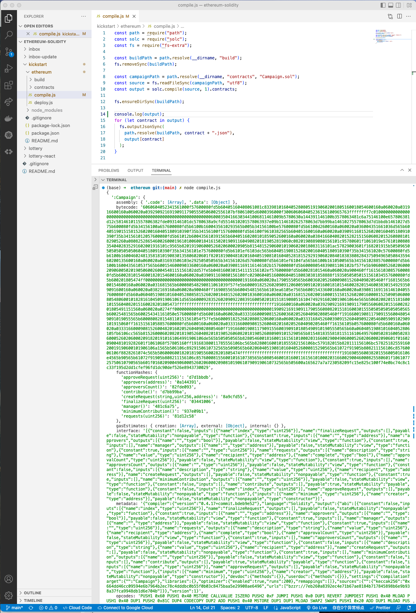
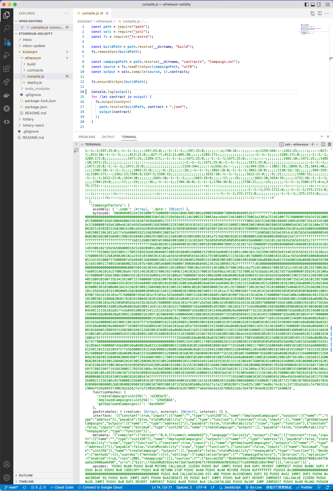

# 148. More on Compile

**compile.js**
```
const path = require("path");
const solc = require("solc");
const fs = require("fs-extra");

const buildPath = path.resolve(__dirname, "build");
fs.removeSync(buildPath);

const campaignPath = path.resolve(__dirname, "contracts", "Campaign.sol");
const source = fs.readFileSync(campaignPath, "utf8");
const output = solc.compile(source, 1).contracts;

fs.ensureDirSync(buildPath);

for (let contract in output) {
  fs.outputJsonSync(
    path.resolve(buildPath, contract.replace(':', '') + ".json"),
    output[contract]
  );
}

```
<details>
  <summary>Compiling capture</summary>


---
</details>

<details>
  <summary>More on Compile</summary>

**compile.js** - More on Compile
```
const path = require("path");
const solc = require("solc");
const fs = require("fs-extra");

const buildPath = path.resolve(__dirname, "build");
fs.removeSync(buildPath);

const campaignPath = path.resolve(__dirname, "contracts", "Campaign.sol");
const source = fs.readFileSync(campaignPath, "utf8");
const output = solc.compile(source, 1).contracts;

fs.ensureDirSync(buildPath);

console.log(output); // More on Compile
for (let contract in output) {
  fs.outputJsonSync(
    path.resolve(buildPath, contract + ".json"),
    output[contract]
  );
}
```  

**Compile capture**

---

---
</details>  

##  Resources for this lecture

---

-   [150-more-compile.zip](https://github.com/web3-nfts/bt-web3/raw/main/Curricula/Ethereum-and-Solidity_The_Complete_Developers_Guide/resources/150-more-compile.zip)