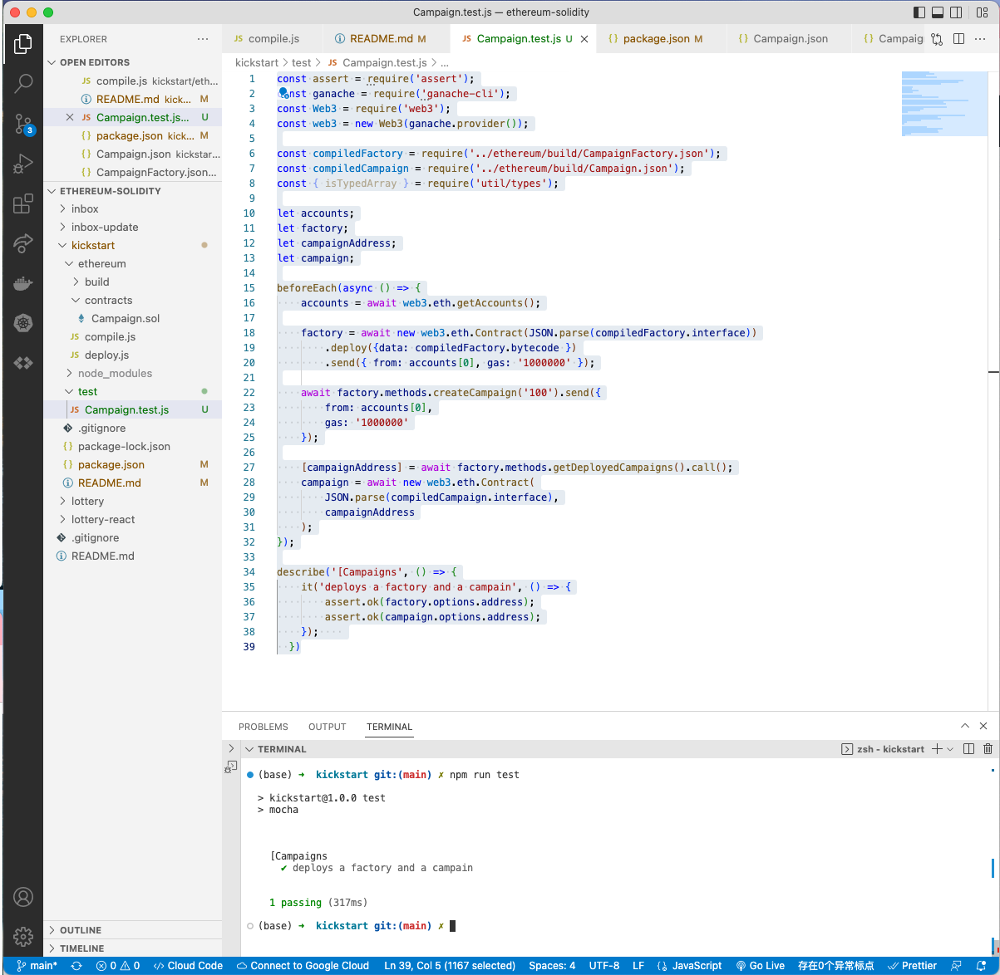

# 151. Testing Warmup

**Campaign.test.ja** - Testing Warmup
```
const assert = require('assert');
const ganache = require('ganache-cli');
const Web3 = require('web3');
const web3 = new Web3(ganache.provider());

const compiledFactory = require('../ethereum/build/CampaignFactory.json');
const compiledCampaign = require('../ethereum/build/Campaign.json');
const { isTypedArray } = require('util/types');

let accounts;
let factory;
let campaignAddress;
let campaign;

beforeEach(async () => {
    accounts = await web3.eth.getAccounts();

    factory = await new web3.eth.Contract(JSON.parse(compiledFactory.interface))
        .deploy({data: compiledFactory.bytecode })
        .send({ from: accounts[0], gas: '1000000' });

    await factory.methods.createCampaign('100').send({
        from: accounts[0],
        gas: '1000000'
    });

    [campaignAddress] = await factory.methods.getDeployedCampaigns().call();
    campaign = await new web3.eth.Contract(
        JSON.parse(compiledCampaign.interface),
        campaignAddress
    );
});

describe('[Campaigns', () => {
    it('deploys a factory and a campain', () => {
        assert.ok(factory.options.address);
        assert.ok(campaign.options.address);
    });    
  })
```

<details>
  <summary>Testing Warmup - capture</summary>


---
</details>    

##  Resources for this lecture

---

-   [153-testing-warmup.zip](https://github.com/web3-nfts/bt-web3/raw/main/Curricula/Ethereum-and-Solidity_The_Complete_Developers_Guide/resources/153-testing-warmup.zip)