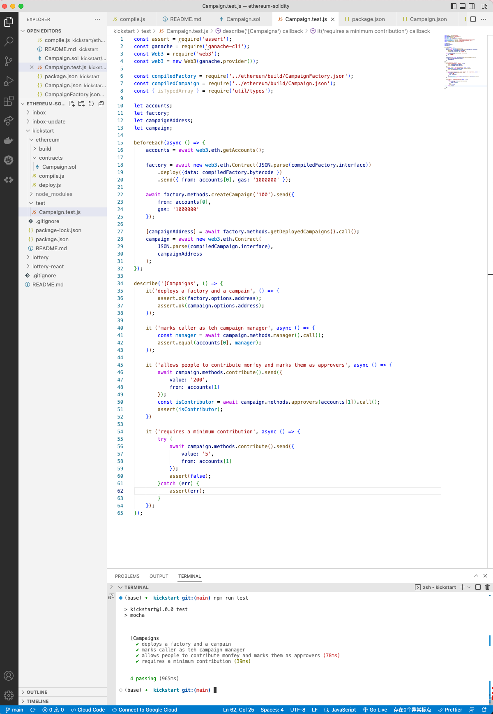

# 153. Requiring Minimum Contributions

**Campaign.test.ja** - Requiring Minimum Contributions
```
const assert = require('assert');
const ganache = require('ganache-cli');
const Web3 = require('web3');
const web3 = new Web3(ganache.provider());

const compiledFactory = require('../ethereum/build/CampaignFactory.json');
const compiledCampaign = require('../ethereum/build/Campaign.json');
const { isTypedArray } = require('util/types');

let accounts;
let factory;
let campaignAddress;
let campaign;

beforeEach(async () => {
    accounts = await web3.eth.getAccounts();

    factory = await new web3.eth.Contract(JSON.parse(compiledFactory.interface))
        .deploy({data: compiledFactory.bytecode })
        .send({ from: accounts[0], gas: '1000000' });

    await factory.methods.createCampaign('100').send({
        from: accounts[0],
        gas: '1000000'
    });

    [campaignAddress] = await factory.methods.getDeployedCampaigns().call();
    campaign = await new web3.eth.Contract(
        JSON.parse(compiledCampaign.interface),
        campaignAddress
    );
});

describe('[Campaigns', () => {
    it('deploys a factory and a campain', () => {
        assert.ok(factory.options.address);
        assert.ok(campaign.options.address);
    });  
    
    it ('marks caller as teh campaign manager', async () => {
        const manager = await campaign.methods.manager().call();
        assert.equal(accounts[0], manager);
    });

    it ('allows people to contribute monfey and marks them as approvers', async () => {
        await campaign.methods.contribute().send({
            value: '200',
            from: accounts[1]
        });  
        const isContributor = await campaign.methods.approvers(accounts[1]).call();  
        assert(isContributor);
    })

    it ('requires a minimum contribution', async () => {
        try {
            await campaign.methods.contribute().send({
                value: '5',
                from: accounts[1]
            });
            assert(false);
        }catch (err) {            
            assert(err);
        }
    });
});
```

<details>
  <summary>Testing - capture: Requiring Minimum Contributions</summary>


---
</details>    

##  Resources for this lecture

---

-   [155-requiring-minimum.zip](https://github.com/web3-nfts/bt-web3/raw/main/Curricula/Ethereum-and-Solidity_The_Complete_Developers_Guide/resources/155-requiring-minimum.zip)