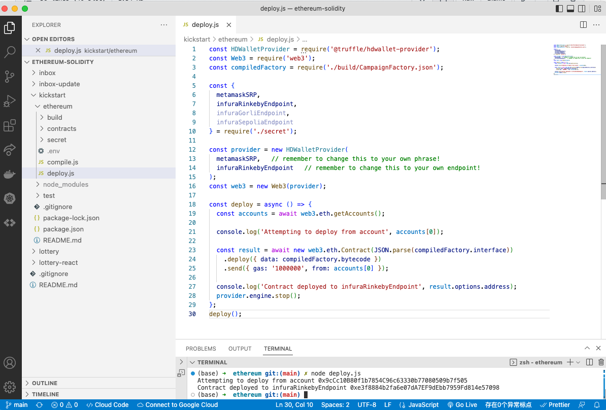
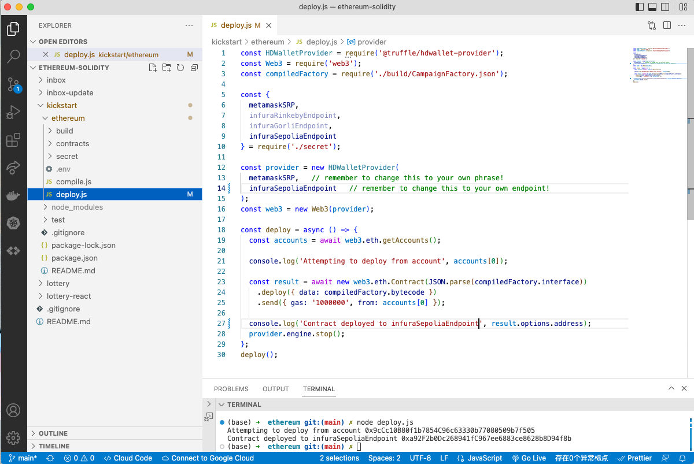

# 157. Refactoring Deployment

**deploy.js** 
```
const HDWalletProvider = require('@truffle/hdwallet-provider');
const Web3 = require('web3');
const compiledFactory = require('./build/CampaignFactory.json');

const { 
  metamaskSRP, 
  infuraRinkebyEndpoint, 
  infuraGorliEndpoint, 
  infuraSepoliaEndpoint 
} = require('./secret');

const provider = new HDWalletProvider(
  metamaskSRP,   // remember to change this to your own phrase!
  infuraRinkebyEndpoint   // remember to change this to your own endpoint!
);
const web3 = new Web3(provider);

const deploy = async () => {
  const accounts = await web3.eth.getAccounts();

  console.log('Attempting to deploy from account', accounts[0]);

  const result = await new web3.eth.Contract(JSON.parse(compiledFactory.interface))
    .deploy({ data: compiledFactory.bytecode })
    .send({ gas: '1000000', from: accounts[0] });

  console.log('Contract deployed to infuraRinkebyEndpoint', result.options.address);
  provider.engine.stop();
};
deploy();
```
<details>
  <summary>Create secrest folder and .env - deployment</summary>

`install dotenv`
```
npm install dotenv
```

`secret/index.js`    
```
require('dotenv').config() 

module.exports = {
  metamaskSRP: process.env.metamaskSRP,
  infuraRinkebyEndpoint: process.env.infuraRinkebyEndpoint,
  infuraGorliEndpoint: process.env.infuraGorliEndpoint,
  infuraSepoliaEndpoint: process.env.infuraSepoliaEndpoint,
}
```

`.env`
```
metamaskSRP = 'this is your own phrase'
infuraRinkebyEndpoint = 'this is your Rinkeby endpoint'
infuraGorliEndpoint = 'this is your Goeril endpoint'
infuraSepoliaEndpoint = 'this is your Sepolia endpoint'
```

-   Deployment to Rinkeby 
    ```
    node deploy.js
    ```


Address:
```
0xe3f8884b2fa6e07dA7EF9dEbb7959Fd814e57098
```
---
-   Deployment to Sepolia 
    ```
    node deploy.js
    ```

Address:
```
0xa92f2b0dc268941fc967ee6883ce8628b8d94f8b
```
---
-   Deployment to Goerli 
    ```
    node deploy.js
    ```

Address:
```
0x96ac2310528a1a428bc1f9c007a13d016ca960d1
```
---
</details>    

##  Resources for this lecture

---

-   [160-refactoring-deployment.zip](https://github.com/web3-nfts/bt-web3/raw/main/Curricula/Ethereum-and-Solidity_The_Complete_Developers_Guide/resources/160-refactoring-deployment.zip)

---

-  [How to setup project - Kickstart](../setup-project-kickstart.md)