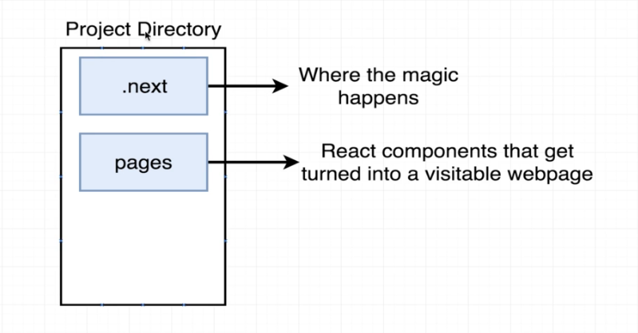
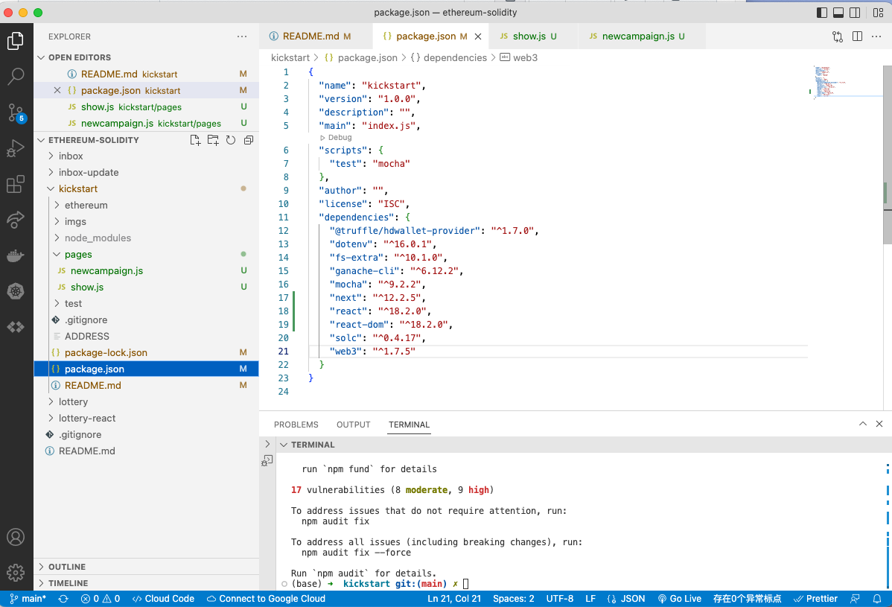

# 160. Next's Pages Architecture

**Install next.js**
```
npm install next react react-dom
```

**Create pages/show.js pages/newcampaign.js**
```
mkdie pages
cd pages
touch show.js
touch newcampaign.js
```

  
---
  
---

<details>
  <summary>Next's Pages Architecture</summary>

  
---

`package.json`
```
{
  "name": "kickstart",
  "version": "1.0.0",
  "description": "",
  "main": "index.js",
  "scripts": {
    "test": "mocha"
  },
  "author": "",
  "license": "ISC",
  "dependencies": {
    "@truffle/hdwallet-provider": "^1.7.0",
    "dotenv": "^16.0.1",
    "fs-extra": "^10.1.0",
    "ganache-cli": "^6.12.2",
    "mocha": "^9.2.2",
    "next": "^12.2.5",
    "react": "^18.2.0",
    "react-dom": "^18.2.0",
    "solc": "^0.4.17",
    "web3": "^1.7.5"
  }
}
```
</details>

##  Resources for this lecture

---

-   [NestJS: The Complete Developer's Guide](https://www.udemy.com/course/nestjs-the-complete-developers-guide/?couponCode=ADCE6741CC-BONUS)

---

-   [Next.js & React - The Complete Guide (incl. Two Paths!)](https://github.com/ShuhanCode/art-javascript/tree/main/Curricula/nextjs)

---

-  [How to setup project - Kickstart](../setup-project-kickstart.md)
