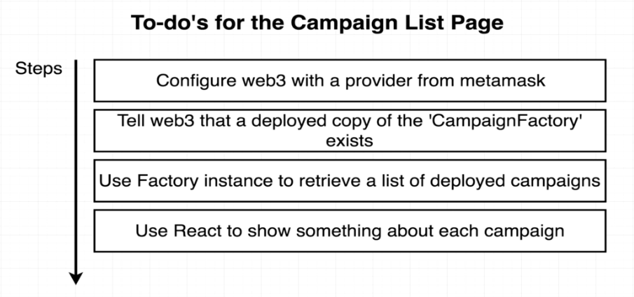

# 162. Root Routes

**index.js** - Root Routes
```
import React from 'react';

export default () => {
    return <h1>This is the campaign list page!!!</h1>
}
```


---

##  Resources for this lecture

---

-   [166-root-routes.zip](https://github.com/web3-nfts/bt-web3/raw/main/Curricula/Ethereum-and-Solidity_The_Complete_Developers_Guide/resources/166-root-routes.zip)

---

-   [How to setup project - Kickstart](../setup-project-kickstart.md)