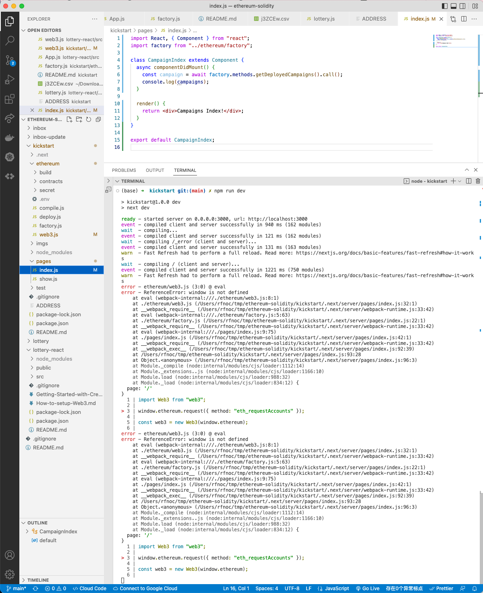
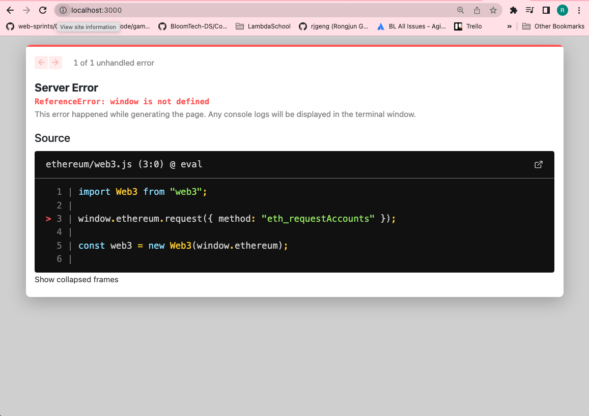

# 167. Fetching Deployed Campaigns

**index.js** - Fetching Deployed Campaigns
```
import React, { Component } from "react";
import factory from "../ethereum/factory";

class CampaignIndex extends Component {
  async componentDidMount() {
    const campaigns = await factory.methods.getDeployedCampaigns().call();
    console.log(campaigns);
  }

  render() {
    return <div>Campaigns Index!</div>;
  }
}

export default CampaignIndex;
```

**web3.js**
```
import Web3 from "web3";
 
let web3;
 
if (typeof window !== "undefined" && typeof window.ethereum !== "undefined") {
  // We are in the browser and metamask is running.
  window.ethereum.request({ method: "eth_requestAccounts" });
  web3 = new Web3(window.ethereum);
} else {
  // We are on the server *OR* the user is not running metamask
  const provider = new Web3.providers.HttpProvider(
    "https://rinkeby.infura.io/v3/15c1d32581894b88a92d8d9e519e476c"
  );
  web3 = new Web3(provider);
}
 
export default web3;
```

<details>
  <summary>compile - issues</summary>


---

---
</details>  

##  Resources for this lecture

---

-   [171-fetching.zip](https://beatlesm.s3.us-west-1.amazonaws.com/ethereum-and-solidity-complete-developer-guide/171-fetching.zip)

