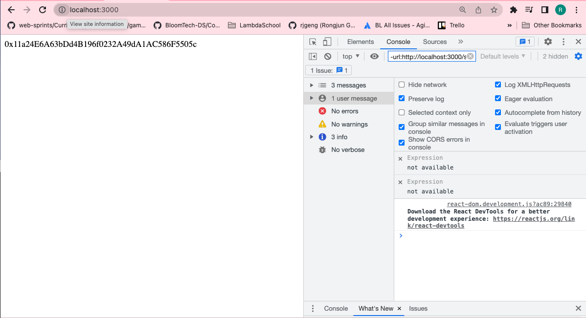
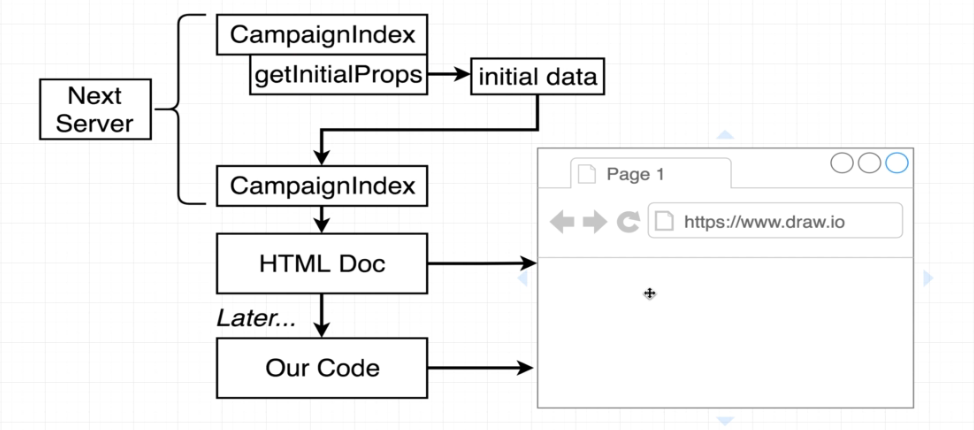

# 171. GetInitialProps Function

**index.js** - GetInitialProps Function
```
import React, { Component } from "react";
import factory from "../ethereum/factory";

class CampaignIndex extends Component {
  static async getInitialProps() {
    const campaigns = await factory.methods.getDeployedCampaigns().call();

    return { campaigns };
  }

  render() {
    return <div>{this.props.campaigns[0]}</div>;
  }
}

export default CampaignIndex;

```

<details>
  <summary>Render - result capture</summary>


---
</details>


---

---

##  Resources for this lecture

---

-   [175-getinitialprops.zip](https://beatlesm.s3.us-west-1.amazonaws.com/ethereum-and-solidity-complete-developer-guide/175-getinitialprops.zip)