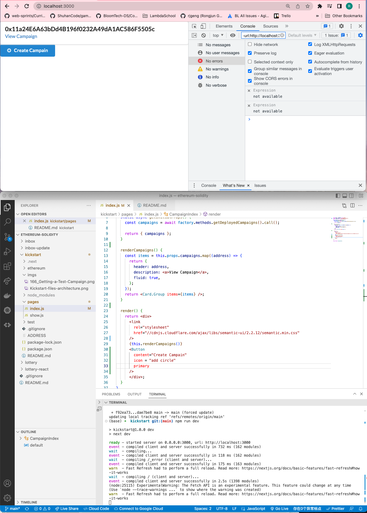

# 176. Adding a Button

**index.js** - Adding a Button
```
import React, { Component } from "react";
import { Card, Button } from "semantic-ui-react";
import factory from "../ethereum/factory";

class CampaignIndex extends Component {
  static async getInitialProps() {
    const campaigns = await factory.methods.getDeployedCampaigns().call();

    return { campaigns };
  }

  renderCampaigns() {
    const items = this.props.campaigns.map((address) => {
      return {
        header: address,
        description: <a>View Campaign</a>,
        fluid: true,
      };
    });
    return <Card.Group items={items} />;
  }

  render() {
    return <div>
      <link
        rel="stylesheet"
        href="//cdnjs.cloudflare.com/ajax/libs/semantic-ui/2.2.12/semantic.min.css"
      />
      {this.renderCampaigns()}
      <Button 
        content="Create Campain"
        icon = "add circle"
        primary
      />
      </div>;
  }
}

export default CampaignIndex;
```

<details>
  <summary>Adding a Button - result capture</summary>


---
</details>

##  Resources for this lecture

---

-   [180-adding-button.zip](https://beatlesm.s3.us-west-1.amazonaws.com/ethereum-and-solidity-complete-developer-guide/180-adding-button.zip)