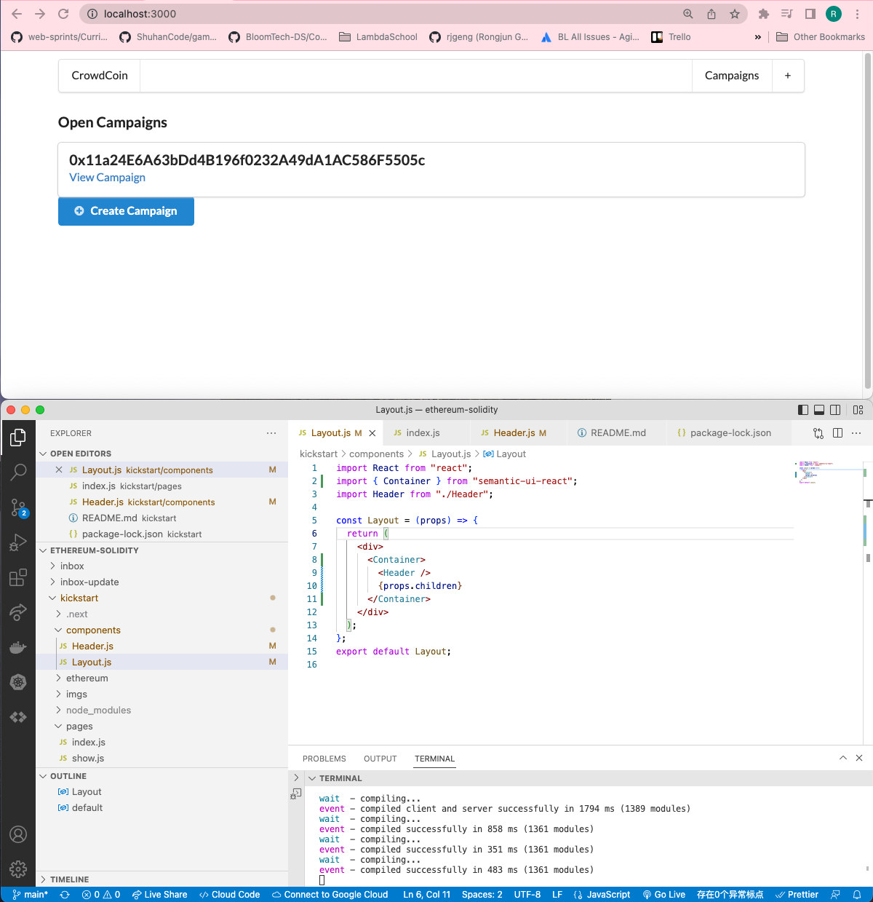
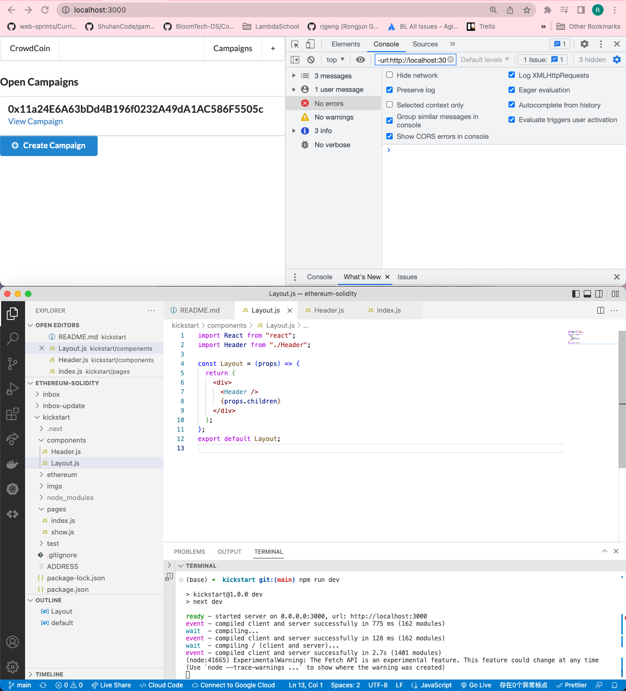

# 181. Constraining Content Width

<details>
  <summary>Constraining Content Width - result capture</summary>


`components/Layout.js`
```
import React from "react";
import { Container } from "semantic-ui-react";
import Header from "./Header";

const Layout = (props) => {
  return (
    <div>
      <Container>
        <Header />
        {props.children}
      </Container>
    </div>
  );
};
export default Layout;

```

`components/Header.js`
```
import React from "react";
import { Menu } from "semantic-ui-react";

const Header = () => {
  return (
    <Menu style={{ marginTop: "10px" }}>
      <Menu.Item>CrowdCoin</Menu.Item>

      <Menu.Menu position="right">
        <Menu.Item>Campaigns</Menu.Item>
        <Menu.Item>+</Menu.Item>
      </Menu.Menu>
    </Menu>
  );
};

export default Header;

```


---

---
</details>

##  Resources for this lecture

---

-   [185-constraining.zip](https://beatlesm.s3.us-west-1.amazonaws.com/ethereum-and-solidity-complete-developer-guide/185-constraining.zip)