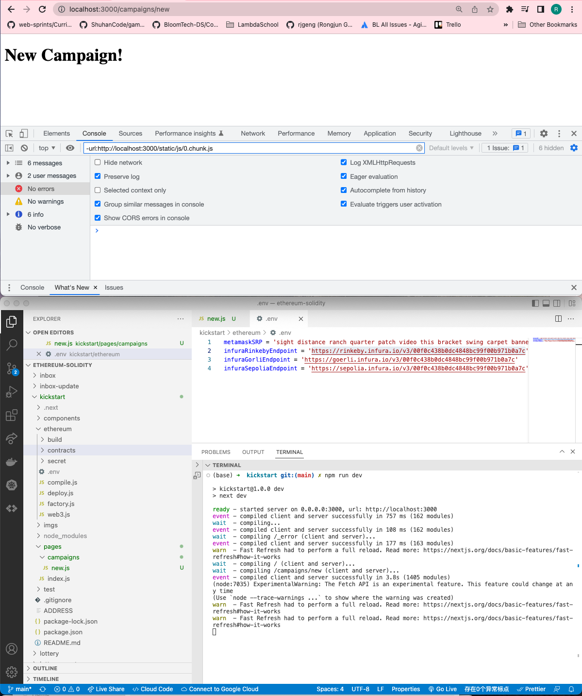

# 183. Nested Routing

**Create Nested Routing**
```
mkdir pages/campaigns
cd campaigns
touch new.js
```

**pages/campaigns/new.js**
```
import React, { Component } from "react";

class CampaignNew extends Component {
    render(){
        return <h1>New Campaign!</h1>
    }
}

export default CampaignNew;
```


---

<details>
  <summary>Nested Routing - result capture</summary>


---
</details>    

##  Resources for this lecture

---

-   [187-nested.zip](https://beatlesm.s3.us-west-1.amazonaws.com/ethereum-and-solidity-complete-developer-guide/187-nested.zip)