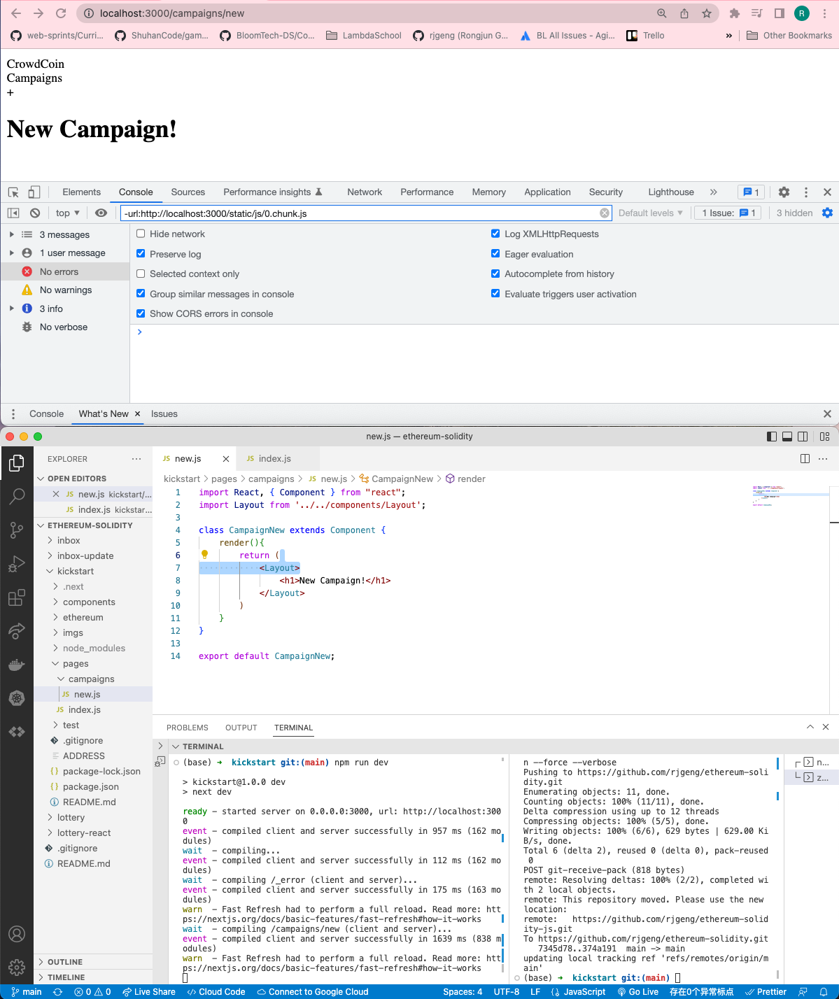
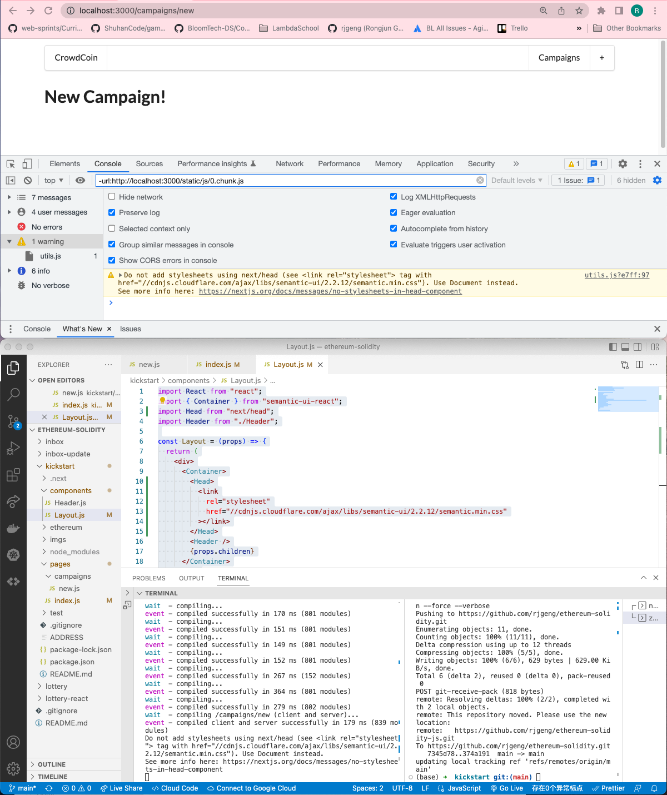

# 184. Final CSS Fix


<details>
  <summary>Final CSS Fix - result capture</summary>

## Add Layout

**pages/campaigns/new.js** -- added Layout
```
import React, { Component } from "react";
import Layout from '../../components/Layout';

class CampaignNew extends Component {
    render(){
        return (
            <Layout>
                <h1>New Campaign!</h1>
            </Layout>        
        )
    }
}

export default CampaignNew;
```


---

## Final CSS Fix

`pages/campains/index.js`
```
import React, { Component } from "react";
import { Card, Button } from "semantic-ui-react";
import factory from "../ethereum/factory";
import Layout from "../components/Layout";

class CampaignIndex extends Component {
  static async getInitialProps() {
    const campaigns = await factory.methods.getDeployedCampaigns().call();

    return { campaigns };
  }
  renderCampaigns() {
    const items = this.props.campaigns.map((address) => {
      return {
        header: address,
        description: <a>View Campaign</a>,
        fluid: true,
      };
    });
    return <Card.Group items={items} />;
  }
  render() {
    return (
      <Layout>
        <div>          
          <h3>Open Campaigns</h3>          
          <Button 
          floated = "right" 
          content="Create Campaign" 
          icon="add circle" 
          primary 
          />
          {this.renderCampaigns()}
        </div>
      </Layout>
    );
  }
}

export default CampaignIndex;

```

`components/Layout.js`
```
import React from "react";
import { Container } from "semantic-ui-react";
import Head from "next/head";
import Header from "./Header";

const Layout = (props) => {
  return (
    <div>
      <Container>
        <Head>
          <link
            rel="stylesheet"
            href="//cdnjs.cloudflare.com/ajax/libs/semantic-ui/2.2.12/semantic.min.css"
          ></link>
        </Head>
        <Header />
        {props.children}
      </Container>
    </div>
  );
};
export default Layout;

```


---
</details>    

##  Resources for this lecture

---

-   [188-final-css.zip](https://beatlesm.s3.us-west-1.amazonaws.com/ethereum-and-solidity-complete-developer-guide/188-final-css.zip)