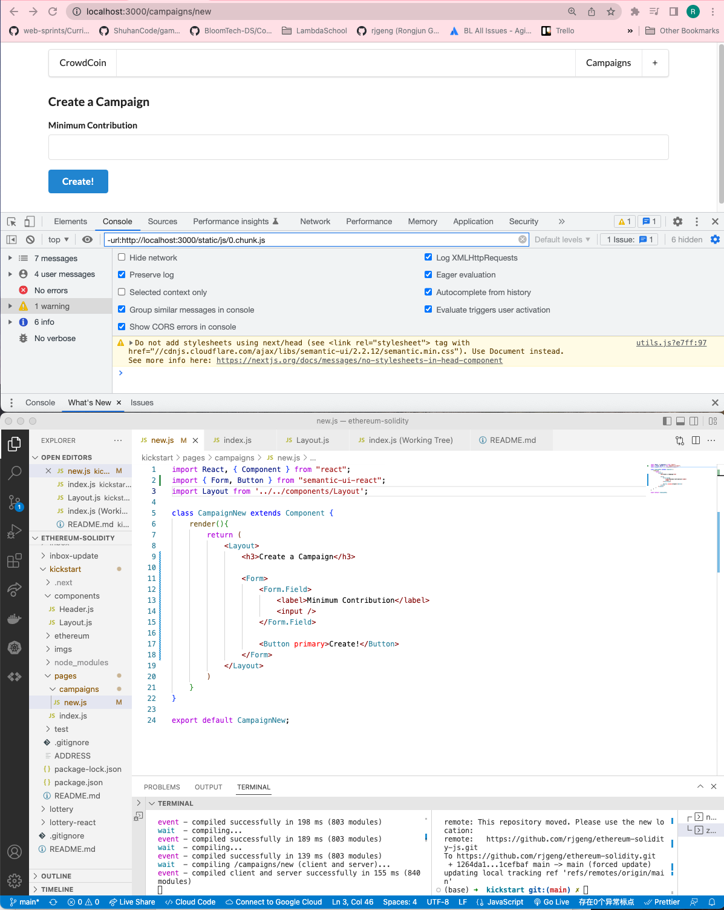

# 185. Form Creation

<details>
  <summary>Form Creation - result capture</summary>

**pages/campaign/new.js**
```
import React, { Component } from "react";
import { Form, Button } from "semantic-ui-react";
import Layout from '../../components/Layout';

class CampaignNew extends Component {
    render(){
        return (
            <Layout>
                <h3>Create a Campaign</h3>

                <Form>
                    <Form.Field>
                        <label>Minimum Contribution</label>
                        <input />
                    </Form.Field>

                    <Button primary>Create!</Button>
                </Form>
            </Layout>        
        )
    }
}

export default CampaignNew;
```


---
</details>    

##  Resources for this lecture

---

-   [189-form-creation.zip](https://beatlesm.s3.us-west-1.amazonaws.com/ethereum-and-solidity-complete-developer-guide/189-form-creation.zip)