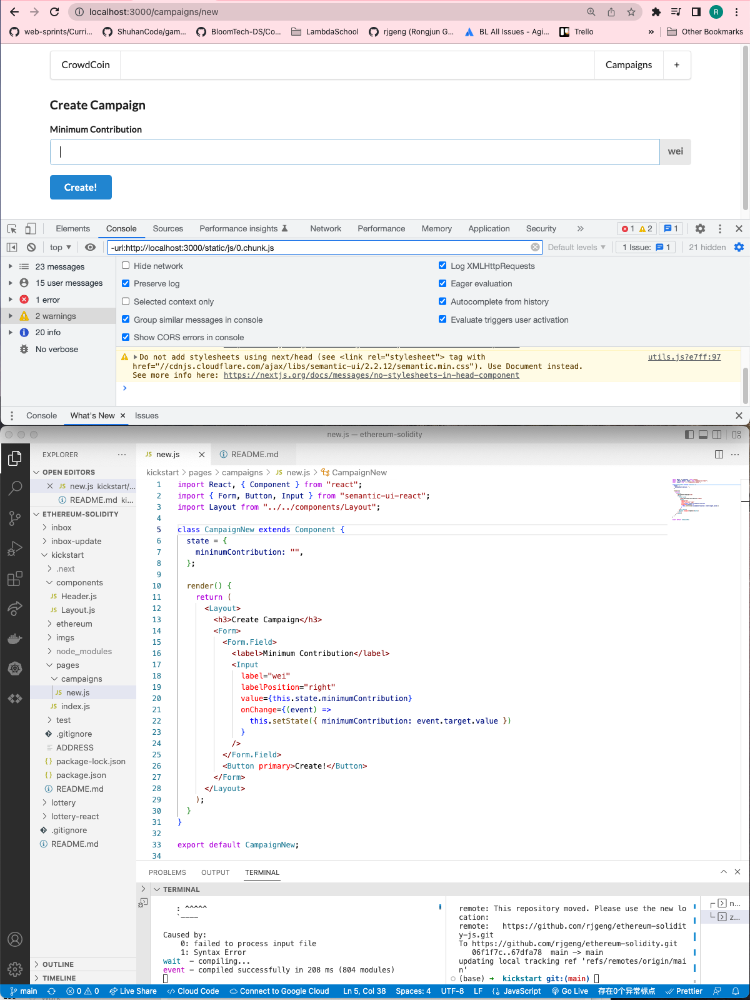

# 186. Input Change Handlers

<details>
  <summary>Input Change Handlers - result capture</summary>

**pages/campaigns/new.js** - Input Change Handlers
```
import React, { Component } from "react";
import { Form, Button, Input } from "semantic-ui-react";
import Layout from "../../components/Layout";

class CampaignNew extends Component {
  state = {
    minimumContribution: "",
  };

  render() {
    return (
      <Layout>
        <h3>Create Campaign</h3>
        <Form>
          <Form.Field>
            <label>Minimum Contribution</label>
            <Input
              label="wei"
              labelPosition="right"
              value={this.state.minimumContribution}
              onChange={(event) =>
                this.setState({ minimumContribution: event.target.value })
              }
            />
          </Form.Field>
          <Button primary>Create!</Button>
        </Form>
      </Layout>
    );
  }
}

export default CampaignNew;
```


---
</details> 

##  Resources for this lecture

---

-   [190-input-change.zip](https://beatlesm.s3.us-west-1.amazonaws.com/ethereum-and-solidity-complete-developer-guide/190-input-change.zip)