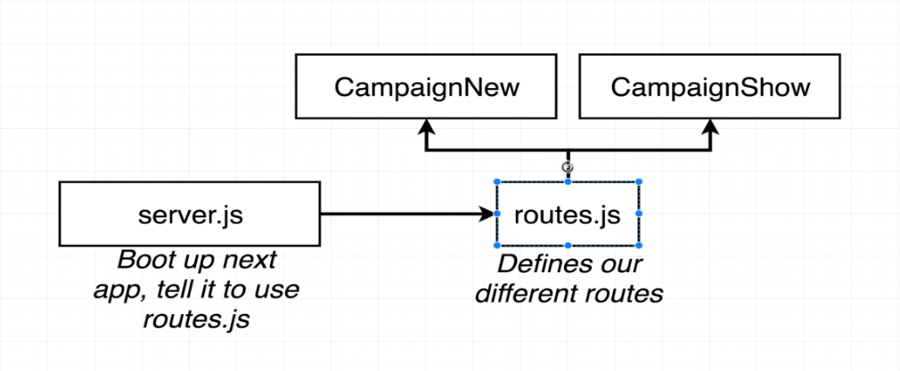
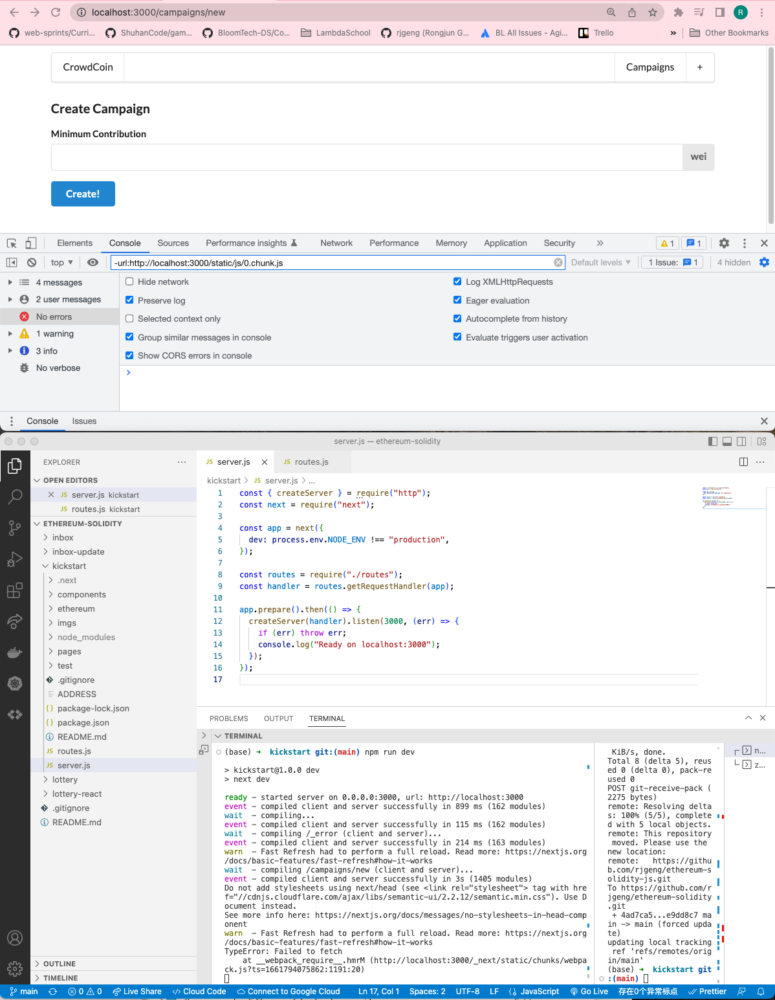

# 193. Next Routes Setup

**install:**
```
npm install next-routes --legacy-peer-deps
```

<details>
  <summary>Next Routes Setup</summary>

**routes.js**
```
const routes = require("next-routes")();

module.exports = routes;
```

**server.js**
```
const { createServer } = require("http");
const next = require("next");

const app = next({
  dev: process.env.NODE_ENV !== "production",
});

const routes = require("./routes");
const handler = routes.getRequestHandler(app);

app.prepare().then(() => {
  createServer(handler).listen(3000, (err) => {
    if (err) throw err;
    console.log("Ready on localhost:3000");
  });
});
```
</details>

**Customerize the script**
-   change the `package.json`
    ```
    "scripts": {
        "dev": "next dev"
    }
    ```
    to
    ```
    "scripts": {
        "dev": "node server.js"
    }
    ```
-   npm run dev 
    ```
    npm run dev
    ```

-   [https://github.com/fridays/next-routes](https://github.com/fridays/next-routes)


---

<details>
  <summary>Next Routes Setup - result capture</summary>


---
</details>

##  Resources for this lecture

---

-   [197-next-routes.zip](https://beatlesm.s3.us-west-1.amazonaws.com/ethereum-and-solidity-complete-developer-guide/197-next-routes.zip)