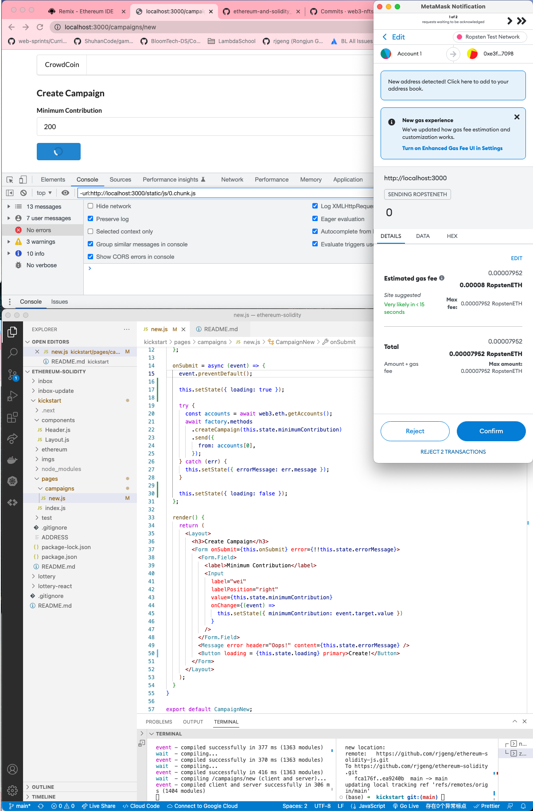
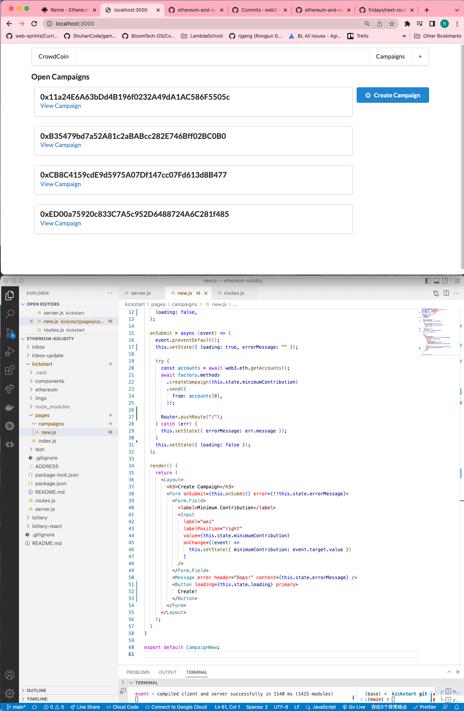

# 194. Automatic Navigation

**pages/campaign/new.js** - Automatic Navigation
```
import React, { Component } from "react";
import { Form, Button, Input, Message } from "semantic-ui-react";
import Layout from "../../components/Layout";
import factory from "../../ethereum/factory";
import web3 from "../../ethereum/web3";
import { Router } from "../../routes";

class CampaignNew extends Component {
  state = {
    minimumContribution: "",
    errorMessage: "",
    loading: false,
  };

  onSubmit = async (event) => {
    event.preventDefault();
    this.setState({ loading: true, errorMessage: "" });

    try {
      const accounts = await web3.eth.getAccounts();
      await factory.methods
        .createCampaign(this.state.minimumContribution)
        .send({
          from: accounts[0],
        });

      Router.pushRoute("/");
    } catch (err) {
      this.setState({ errorMessage: err.message });
    }
    this.setState({ loading: false });
  };

  render() {
    return (
      <Layout>
        <h3>Create Campaign</h3>
        <Form onSubmit={this.onSubmit} error={!!this.state.errorMessage}>
          <Form.Field>
            <label>Minimum Contribution</label>
            <Input
              label="wei"
              labelPosition="right"
              value={this.state.minimumContribution}
              onChange={(event) =>
                this.setState({ minimumContribution: event.target.value })
              }
            />
          </Form.Field>
          <Message error header="Oops!" content={this.state.errorMessage} />
          <Button loading={this.state.loading} primary>
            Create!
          </Button>
        </Form>
      </Layout>
    );
  }
}

export default CampaignNew;
```

<details>
  <summary>Automatic Navigation - result capture</summary>


---

**click `create` and `confirm` on metamask, it will automatic navigated to following:**


---
</details>

##  Resources for this lecture

---

-   [198-automatic.zip](https://beatlesm.s3.us-west-1.amazonaws.com/ethereum-and-solidity-complete-developer-guide/198-automatic.zip)