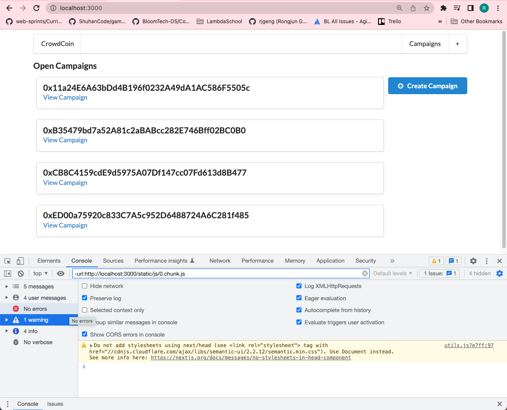

# 195. Header Navigation

**components/Header.js** - Header Navigation
```
import React from "react";
import { Menu } from "semantic-ui-react";
import { Link } from "../routes";

const Header = () => {
  return (
    <Menu style={{ marginTop: "10px" }}>
      <Link route="/">
        <a className="item">CrowdCoin</a>
      </Link>
      <Menu.Menu position="right">
        <Link route="/">
          <a className="item">Campaigns</a>
        </Link>

        <Link route="/campaigns/new">
          <a className="item">+</a>
        </Link>
      </Menu.Menu>
    </Menu>
  );
};

export default Header;
```

<details>
  <summary>Header Navigation - result capture</summary>

**The header buttons `CrowdCoin` `Campaigns`, `+` should be functional**


---
</details>

##  Resources for this lecture

---

-   [199-header-navigation.zip](https://beatlesm.s3.us-west-1.amazonaws.com/ethereum-and-solidity-complete-developer-guide/199-header-navigation.zip)