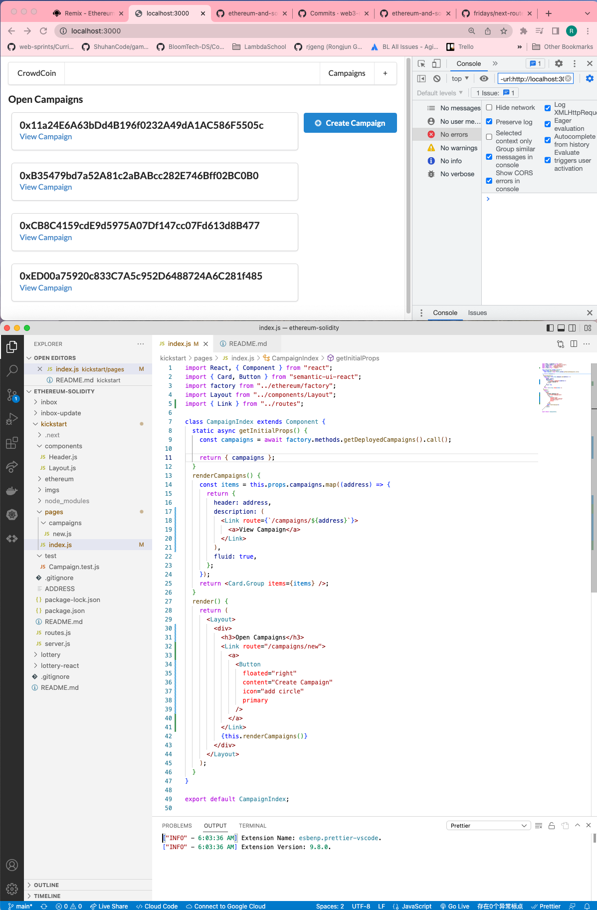
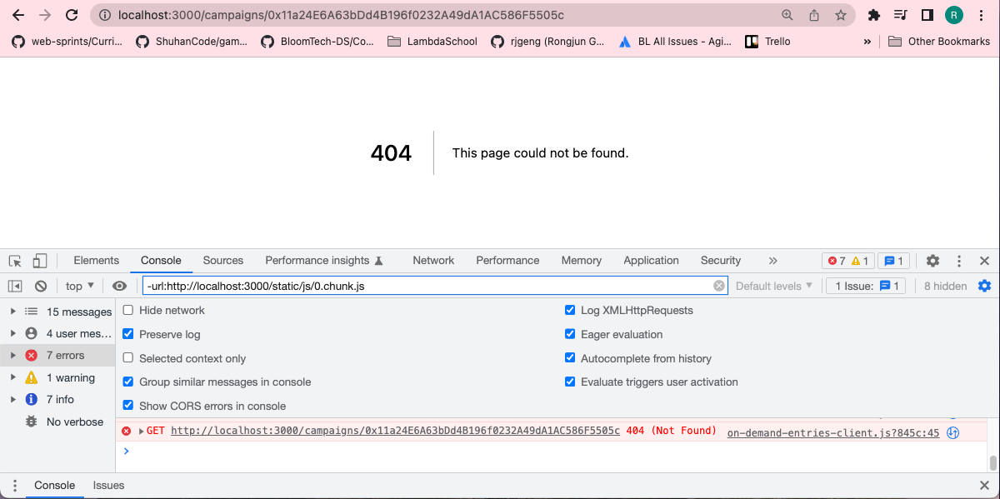

# 196. Routing to Campaigns

**pages/index.js** - Routing to Campaigns
```
import React, { Component } from "react";
import { Card, Button } from "semantic-ui-react";
import factory from "../ethereum/factory";
import Layout from "../components/Layout";
import { Link } from "../routes";

class CampaignIndex extends Component {
  static async getInitialProps() {
    const campaigns = await factory.methods.getDeployedCampaigns().call();

    return { campaigns };
  }
  renderCampaigns() {
    const items = this.props.campaigns.map((address) => {
      return {
        header: address,
        description: (
          <Link route={`/campaigns/${address}`}>
            <a>View Campaign</a>
          </Link>
        ),
        fluid: true,
      };
    });
    return <Card.Group items={items} />;
  }
  render() {
    return (
      <Layout>
        <div>
          <h3>Open Campaigns</h3>
          <Link route="/campaigns/new">
            <a>
              <Button
                floated="right"
                content="Create Campaign"
                icon="add circle"
                primary
              />
            </a>
          </Link>
          {this.renderCampaigns()}
        </div>
      </Layout>
    );
  }
}

export default CampaignIndex;

```


<details>
  <summary>Routing to Campaigns - result capture</summary>


---

**Click `View Campaign` and notice the coming url address**


---
</details>

##  Resources for this lecture

---

-   [200-routing-campaigns.zip](https://beatlesm.s3.us-west-1.amazonaws.com/ethereum-and-solidity-complete-developer-guide/200-routing-campaigns.zip)