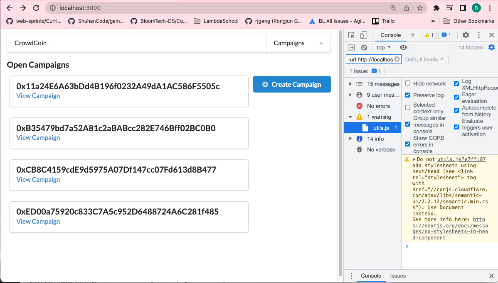
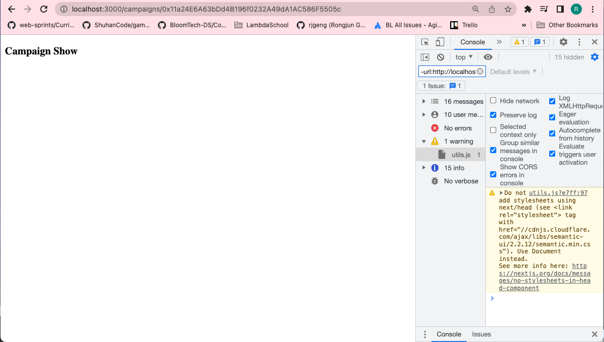

# 198. Route Mappings

**pages/campaigns/show.js**
```
import React, { Component } from "react";

class CampaignShow extends Component {
  render() {
    return <h3>Campaign Show</h3>;
  }
}

export default CampaignShow;
```

**rotues.js**
```
const routes = require("next-routes")();

routes
  .add("/campaigns/new", "/campaigns/new")
  .add("/campaigns/:address", "/campaigns/show");

module.exports = routes;
```

<details>
  <summary>Route Mappings - result capture</summary>


---

**Click `View Campaign` and notice the coming url address**


---
</details>

##  Resources for this lecture

---

-   [202-route-mappings.zip](https://beatlesm.s3.us-west-1.amazonaws.com/ethereum-and-solidity-complete-developer-guide/202-route-mappings.zip)