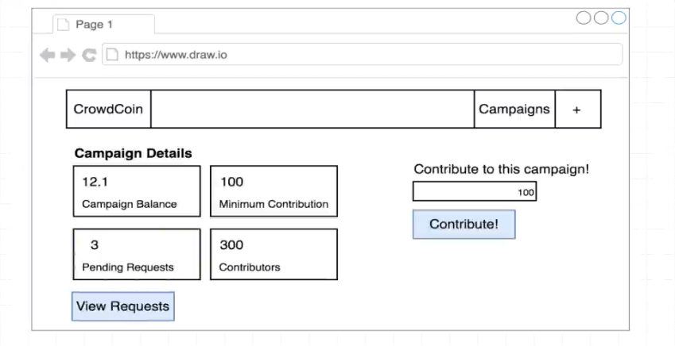
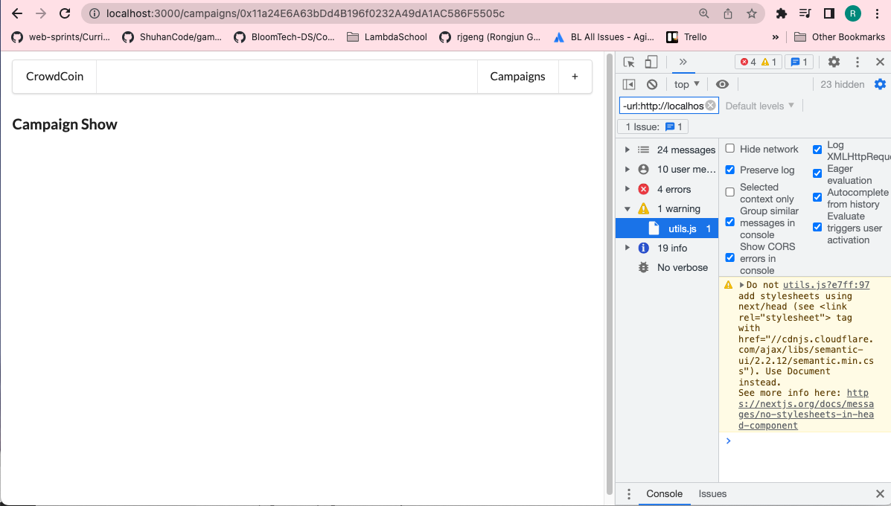

# 199. Planning CampaignShow

**pages/campaigns/show.js** - Planning CampaignShow
```
import React, { Component } from "react";
import Layout from "../../components/Layout";

class CampaignShow extends Component {
  render() {
    return (
      <Layout>
        <h3>Campaign Show</h3>
      </Layout>
    );
  }
}

export default CampaignShow;
```


---

<details>
  <summary>Planning CampaignShow - result capture</summary>


---
</details>

##  Resources for this lecture

---

-   [203-planning.zip](https://beatlesm.s3.us-west-1.amazonaws.com/ethereum-and-solidity-complete-developer-guide/203-planning.zip)