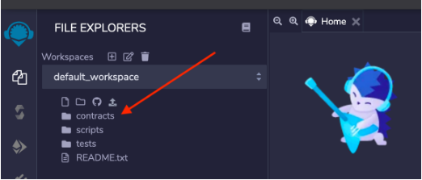
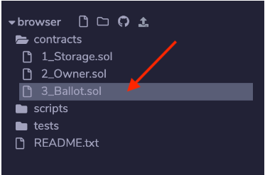
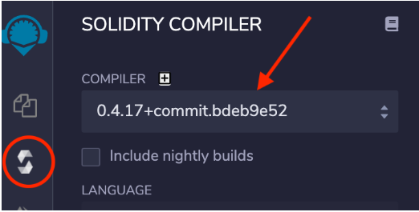
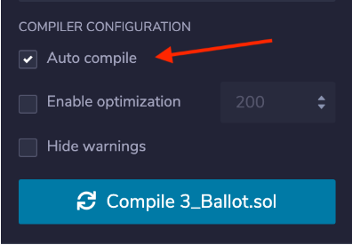

# 19. Updated Remix Instructions for new UI - Do Not Skip

In the upcoming lecture, we will be using the Remix editor to begin writing a simple contract. This note will provide instructions for navigating Remix's new UI.

1.  Load Remix in your browser by visiting this link: https://remix.ethereum.org/

1.  Click the **contracts** directory in the **default_workspace**

 

3.  Open the **3_Ballot.sol** file and delete all of the code within it.

 

4.  Click the icon **"S"** icon in the left sidebar and then change the **COMPILER** version to **0.4.17+commit.bdeb9e52** to match the lecture videos.

 

5.  Find the COMPILER CONFIGURATION section and tick the Auto compile box. With this option enabled, Remix will compile the contract automatically.

 

6.  You should now be all caught to begin writing your contract code as shown in the lecture video.

**Note** *- If you exit Remix in your browser you may need to perform these steps over again. Also, if you use the file browser to switch between files in the editor it may default the compiler back to the latest version.*

---

- [19. Updated Remix Instructions for new UI - Do Not Skip](https://www.udemy.com/course/ethereum-and-solidity-the-complete-developers-guide/learn/lecture/26011910#questions)