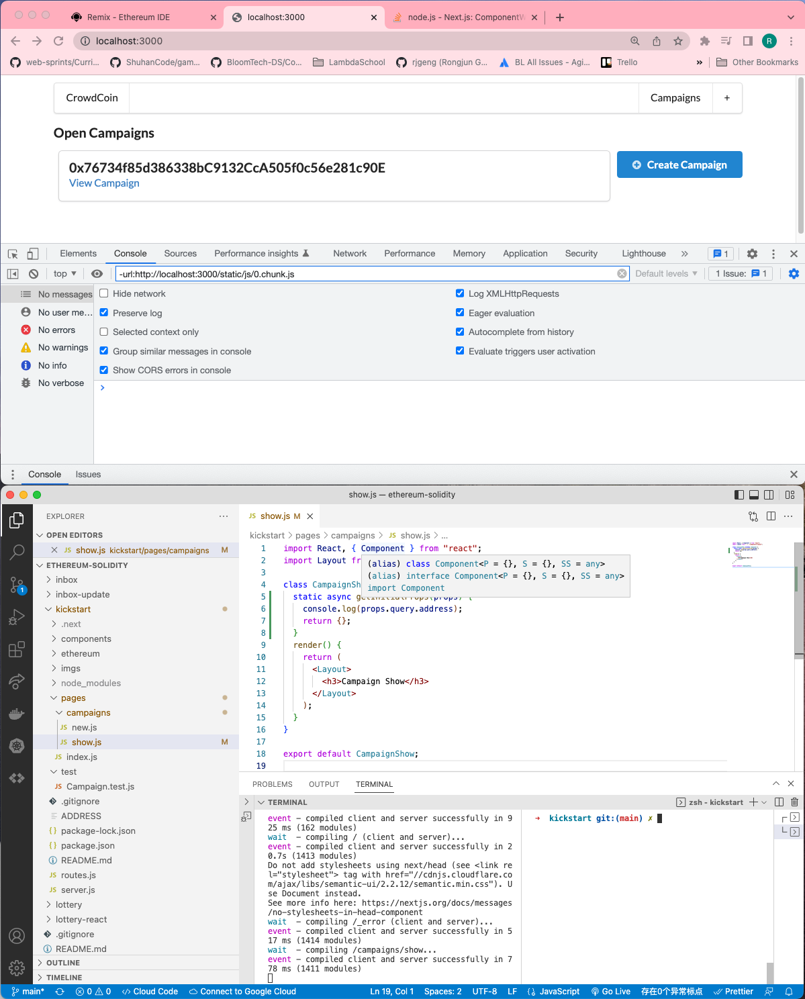
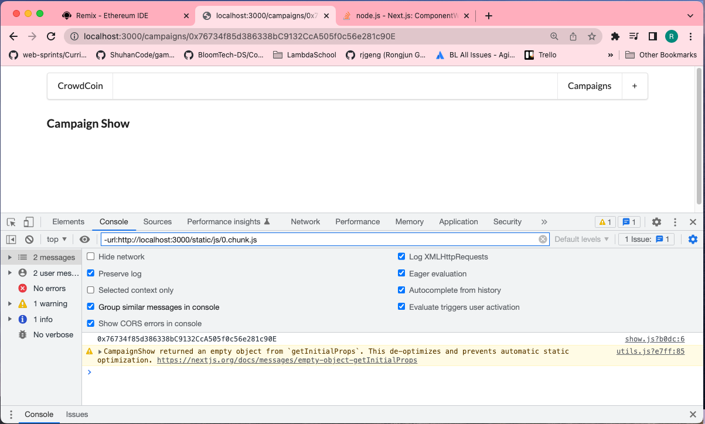

# 201. CampaignShow's GetInitialProps

**pages/campaigns/show.js**
```
import React, { Component } from "react";
import Layout from "../../components/Layout";

class CampaignShow extends Component {
  static async getInitialProps(props) {
    console.log(props.query.address);
    return {};
  }
  render() {
    return (
      <Layout>
        <h3>Campaign Show</h3>
      </Layout>
    );
  }
}

export default CampaignShow;
```

<details>
  <summary>CampaignShow's GetInitialProps - capture</summary>


---

**Click `View Campaign` and notice the information on coming Console**


---
</details>

##  Resources for this lecture

-   [Next.js: ComponentWillMount vs. getInitialProps](https://stackoverflow.com/questions/47461803/next-js-componentwillmount-vs-getinitialprops#:~:text=Here%20is%20a%20rule%20of,state%20upon%20an%20Ajax%20call.)

---

-   [205-campaignshow.zip](https://beatlesm.s3.us-west-1.amazonaws.com/ethereum-and-solidity-complete-developer-guide/205-campaignshow.zip)