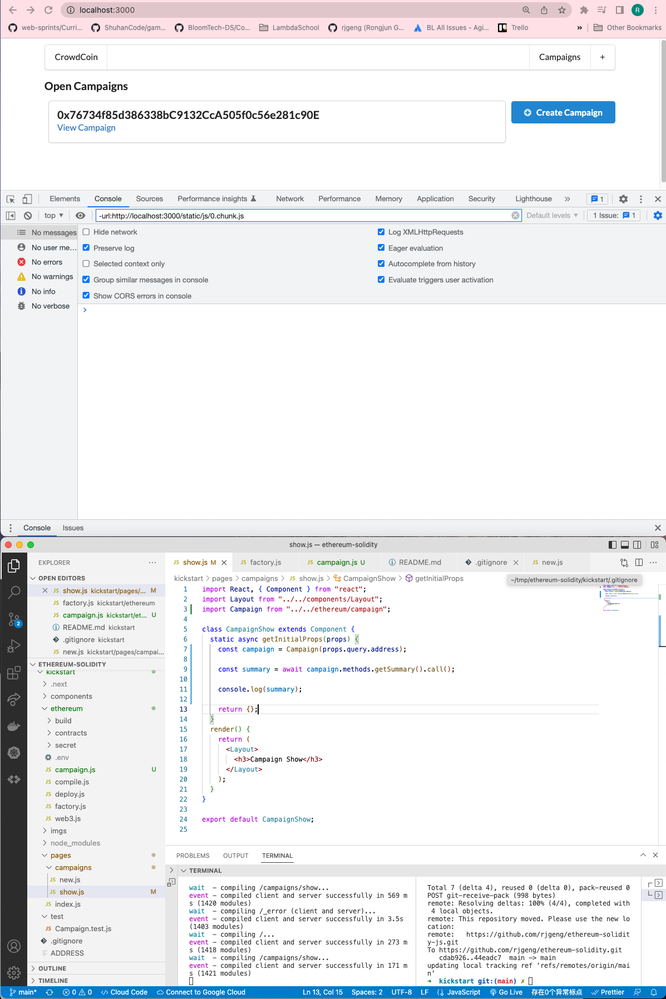
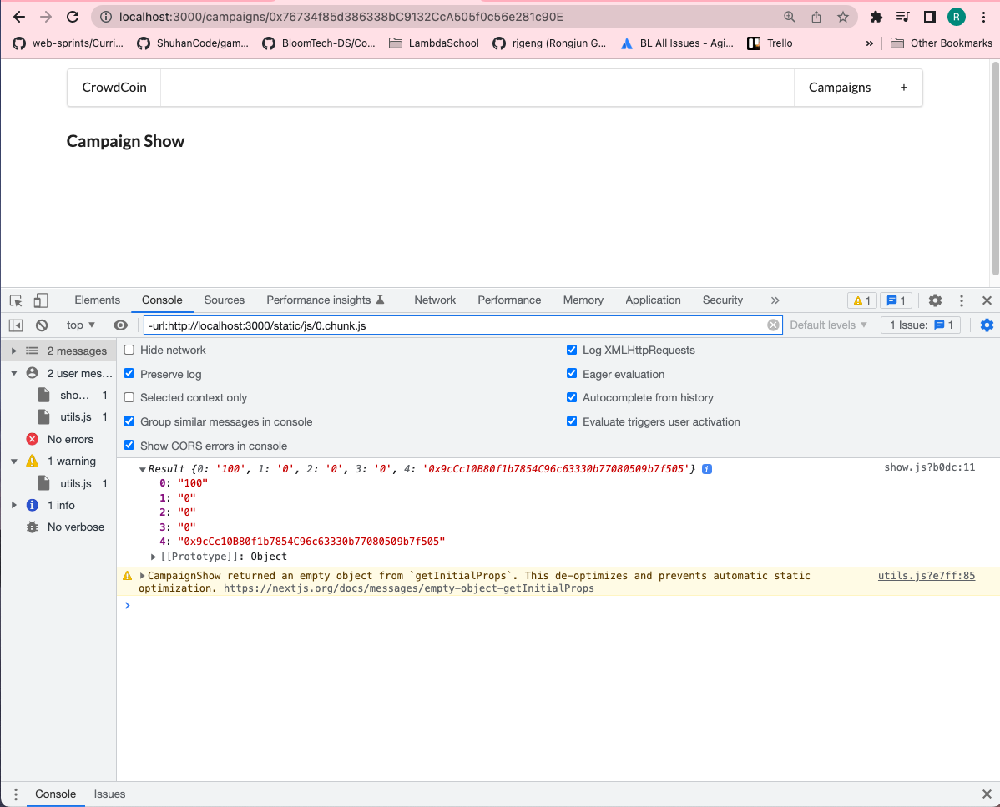

# 202. Accessing a Campaign

**Create ethereum/campaign.js**
```
import web3 from "./web3";
import Campaign from "./build/Campaign.json";

const campaign = (address) => {
  return new web3.eth.Contract(JSON.parse(Campaign.interface), address);
};
export default campaign;
```

**pages/campaigns/show.js**
```
import React, { Component } from "react";
import Layout from "../../components/Layout";
import Campaign from "../../ethereum/campaign";

class CampaignShow extends Component {
  static async getInitialProps(props) {
    const campaign = Campaign(props.query.address);

    const summary = await campaign.methods.getSummary().call();

    console.log(summary);

    return {};
  }
  render() {
    return (
      <Layout>
        <h3>Campaign Show</h3>
      </Layout>
    );
  }
}

export default CampaignShow;
```

<details>
  <summary>Accessing a Campaign - capture</summary>


---

**Click `View Campaign` and notice the information on coming Console**


---
</details>

##  Resources for this lecture

---

-   [206-accessing.zip](https://beatlesm.s3.us-west-1.amazonaws.com/ethereum-and-solidity-complete-developer-guide/206-accessing.zip)