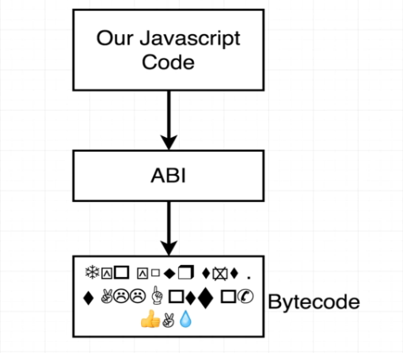
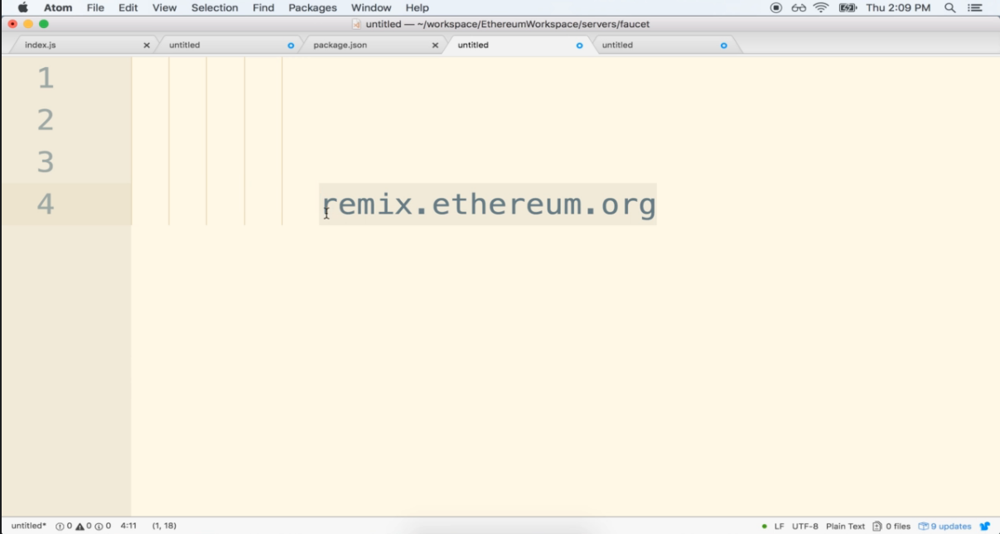

#   20. Our First Contract


---

---

## **Our First Contract** 
-   `inbox.sol`
    ```
    pragma solidity ^0.4.17;

    contract Inbox {
        string public message;
        
        function Inbox(string initialMessage) public {
            message = initialMessage;
        }
        
        function setMessage(string newMessage) public {
            message = newMessage;
        }
    }
    ```

---

-   [20-our-first.zip](https://github.com/web3-nfts/bt-web3/raw/main/Curricula/Ethereum-and-Solidity_The_Complete_Developers_Guide/resources/20-our-first.zip)