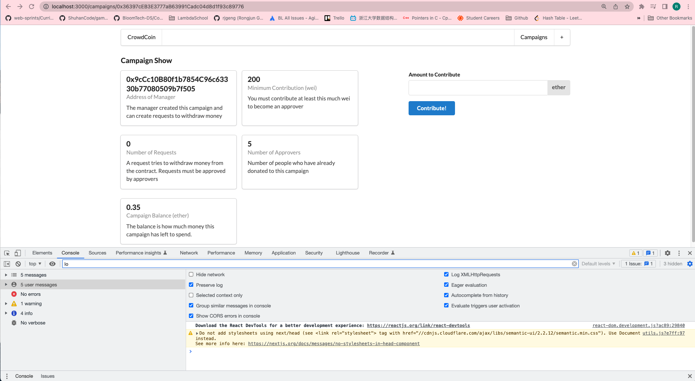
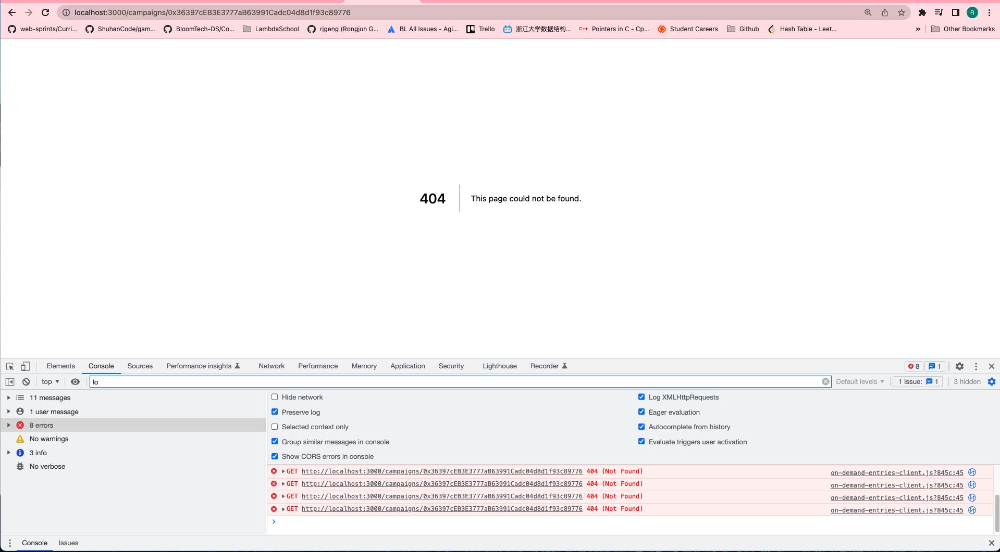

# 210. Making a Contribution

**components/ContributeForm.js** - Making a Contribution
```
import React, { Component } from "react";
import { Form, Input, Message, Button } from "semantic-ui-react";
import Campaign from "../ethereum/campaign"; // --- Communicating the Campaign Address

class ContributeForm extends Component {
  state = {
    value: "",
  };

  onSubmit = async (event) => {
    event.preventDefault();

    const campaign = Campaign(this.props.address); // --- Communicating the Campaign Address
    
  };

  render() {
    return (
      <Form onSubmit={this.onSubmit}>
        <Form.Field>
          <label>Amount to Contribute</label>
          <Input
            value={this.state.value}
            onChange={(event) => this.setState({ value: event.target.value })}
            label="ether"
            labelPosition="right"
          />
        </Form.Field>
        <Button primary>Contribute!</Button>
      </Form>
    );
  }
}

export default ContributeForm;

```

<details>
  <summary>Making a Contribution - capture</summary>


---

**Note: Contribute works but hard-reloading error - 404**


---

</details>

##  Resources for this lecture

---

-   [214-making-contribution.zip](https://beatlesm.s3.us-west-1.amazonaws.com/ethereum-and-solidity-complete-developer-guide/214-making-contribution.zip)