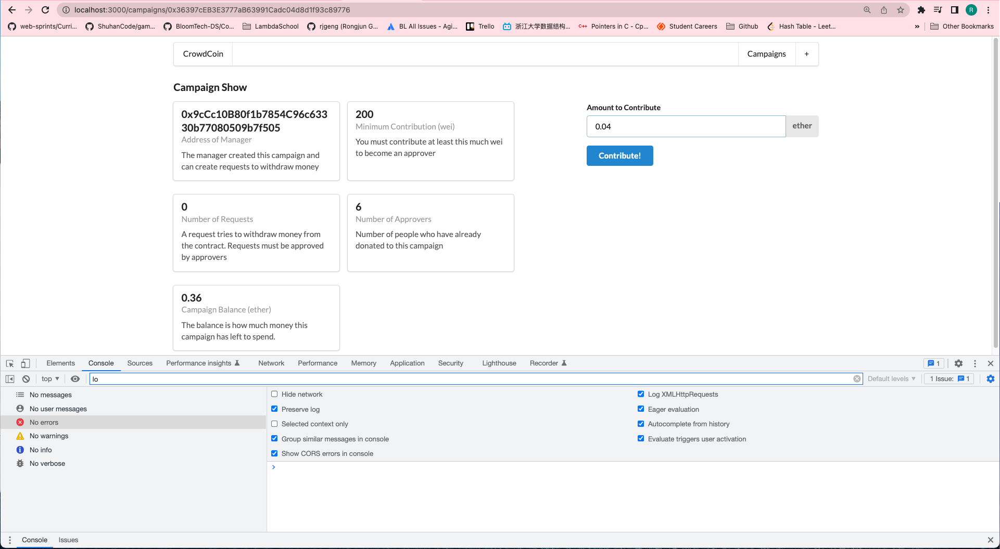
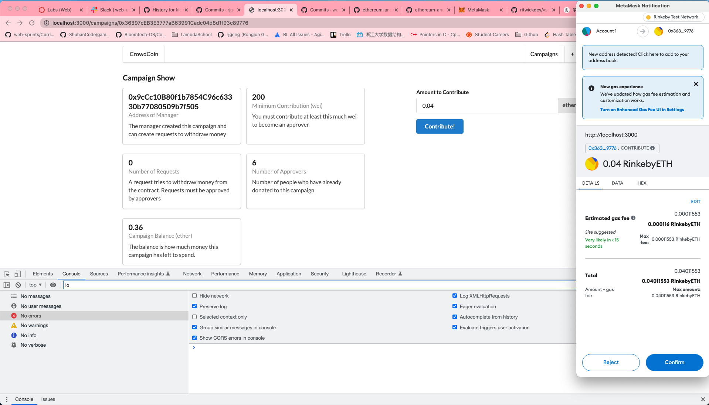
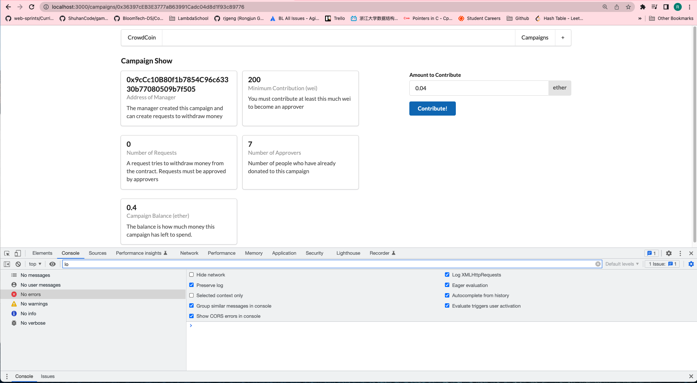

# 211. Refreshing Contract Data

**components/ContributeForm.js** - Refreshing Contract Data
```
import React, { Component } from "react";
import { Form, Input, Message, Button } from "semantic-ui-react";
import Campaign from "../ethereum/campaign";
import web3 from "../ethereum/web3";
import { Router } from "../routes";

class ContributeForm extends Component {
  state = {
    value: "",
  };

  onSubmit = async (event) => {
    event.preventDefault();

    const campaign = Campaign(this.props.address);

    try {
      const accounts = await web3.eth.getAccounts();
      await campaign.methods.contribute().send({
        from: accounts[0],
        value: web3.utils.toWei(this.state.value, "ether"),
      });
      Router.replaceRoute(`/campaigns/${this.props.address}`);
    } catch (err) {}
  };

  render() {
    return (
      <Form onSubmit={this.onSubmit}>
        <Form.Field>
          <label>Amount to Contribute</label>
          <Input
            value={this.state.value}
            onChange={(event) => this.setState({ value: event.target.value })}
            label="ether"
            labelPosition="right"
          />
        </Form.Field>
        <Button primary>Contribute!</Button>
      </Form>
    );
  }
}

export default ContributeForm;

```

<details>
  <summary>Refreshing Contract Data - capture</summary>

**Note: Click Contribute button**  


---

**Note: Click Confirm button on metamask**


---

**Note: waitting 7 ~ 10 seconds to notice the data changing**


---
</details>


##  Resources for this lecture

---

-   [215-refreshing.zip](https://beatlesm.s3.us-west-1.amazonaws.com/ethereum-and-solidity-complete-developer-guide/215-refreshing.zip)