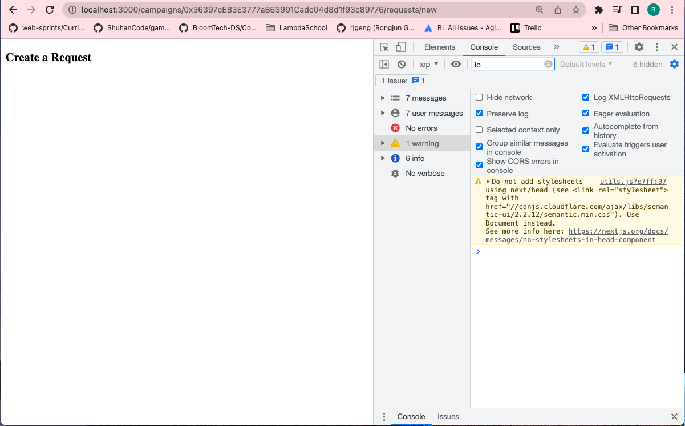

# 215. More Routing!

**pages/campaigns/requests/index.js** - More Routing!
```
import React, { Component } from "react";
import { Button } from "semantic-ui-react";
import { Link } from "../../../routes";
import Layout from "../../../components/Layout";

class RequestIndex extends Component {
  static async getInitialProps(props) {
    const { address } = props.query;

    return { address };
  }
  render() {
    return (
      <Layout>
        <h3>Requests</h3>
        <Link route={`/campaigns/${this.props.address}/requests/new`}>
          <a>
            <Button primary>Add Request</Button>
          </a>
        </Link>
      </Layout>
    );
  }
}

export default RequestIndex;
```

**Create `pages/campaigns/requests/new.js`** - Listing Requests
```
import React, { Component } from "react";

class RequestNew extends Component {
  render() {
    return <h3>Create a Request</h3>;
  }
}

export default RequestNew;
```

**routes.js** - Listing Requests
```
const routes = require("next-routes")();

routes
  .add("/campaigns/new", "/campaigns/new")
  .add("/campaigns/:address", "/campaigns/show")
  .add("/campaigns/:address/requests", "/campaigns/requests/index")
  .add("/campaigns/:address/requests/new", "/campaigns/requests/new");

module.exports = routes;
```

<details>
  <summary>More Routing! - capture</summary>


---
</details>

##  Resources for this lecture

---

-   [219-more-routing.zip](https://beatlesm.s3.us-west-1.amazonaws.com/ethereum-and-solidity-complete-developer-guide/219-more-routing.zip)