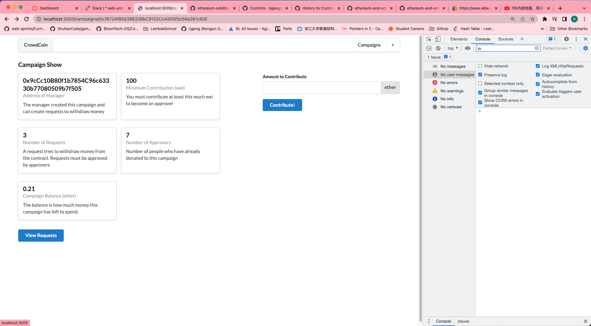
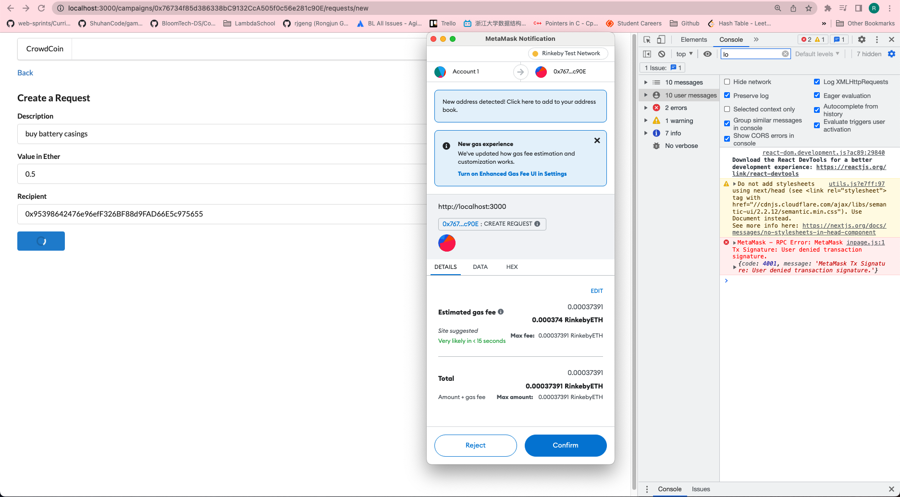
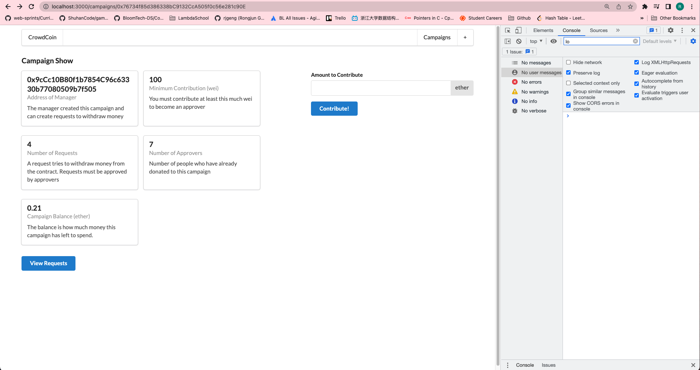

# 219. Creating a Request

  
Creating a Request - capture

**Note: the Number of Requests on Campaign Show**

---
**Note: key in valid address, click confirm on metamask** 

---
**Note: the Number of Requests on Campaign Show**

---

##  Resources for this lecture

