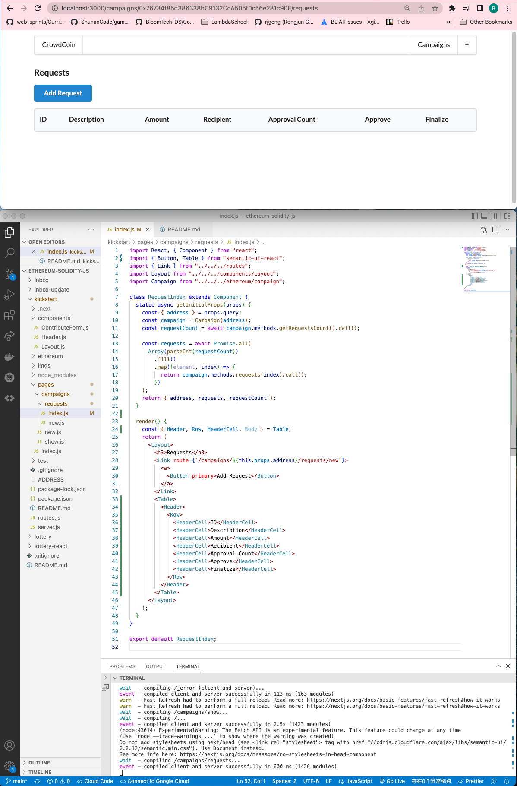

# 223. Rendering a Table

**pages/campaigns/requests/index.js** - Rendering a Table
```
import React, { Component } from "react";
import { Button, Table } from "semantic-ui-react";
import { Link } from "../../../routes";
import Layout from "../../../components/Layout";
import Campaign from "../../../ethereum/campaign";

class RequestIndex extends Component {
  static async getInitialProps(props) {
    const { address } = props.query;
    const campaign = Campaign(address);
    const requestCount = await campaign.methods.getRequestsCount().call();

    const requests = await Promise.all(
      Array(parseInt(requestCount))
        .fill()
        .map((element, index) => {
          return campaign.methods.requests(index).call();
        })
    );
    return { address, requests, requestCount };
  }

  render() {
    const { Header, Row, HeaderCell, Body } = Table;
    return (
      <Layout>
        <h3>Requests</h3>
        <Link route={`/campaigns/${this.props.address}/requests/new`}>
          <a>
            <Button primary>Add Request</Button>
          </a>
        </Link>
        <Table>
          <Header>
            <Row>
              <HeaderCell>ID</HeaderCell>
              <HeaderCell>Description</HeaderCell>
              <HeaderCell>Amount</HeaderCell>
              <HeaderCell>Recipient</HeaderCell>
              <HeaderCell>Approval Count</HeaderCell>
              <HeaderCell>Approve</HeaderCell>
              <HeaderCell>Finalize</HeaderCell>
            </Row>
          </Header>
        </Table>
      </Layout>
    );
  }
}

export default RequestIndex;
```

<details>
  <summary>Rendering a Table - capture</summary>


---
</details>


##  Resources for this lecture

---

-   [227-rendering.zip](https://beatlesm.s3.us-west-1.amazonaws.com/ethereum-and-solidity-complete-developer-guide/227-rendering.zip)