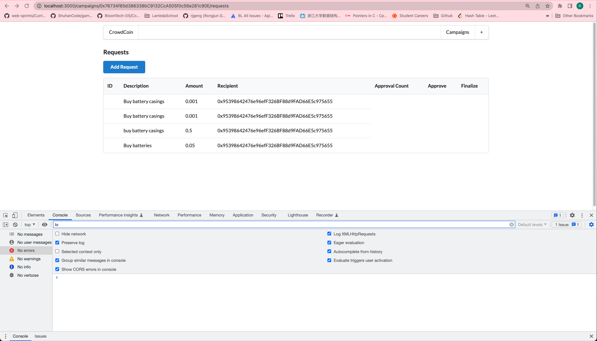

# 225. Request Row Content

**components/RequestRow.js** - Request Row Content
```
import React, { Component } from "react";
import { Table } from "semantic-ui-react";
import web3 from "../ethereum/web3";

class RequestRow extends Component {
  render() {
    const { Row, Cell } = Table;
    const { id, request } = this.props;

    return (
      <Row>
        <Cell>{id}</Cell>
        <Cell>{request.description}</Cell>
        <Cell>{web3.utils.fromWei(request.value, "ether")}</Cell>
        <Cell>{request.recipient}</Cell>
      </Row>
    );
  }
}

export default RequestRow;
```

<details>
  <summary>Request Row Content - capture</summary>


---
</details>

##  Resources for this lecture

---

-   [229-request-row-content.zip](https://beatlesm.s3.us-west-1.amazonaws.com/ethereum-and-solidity-complete-developer-guide/229-request-row-content.zip)