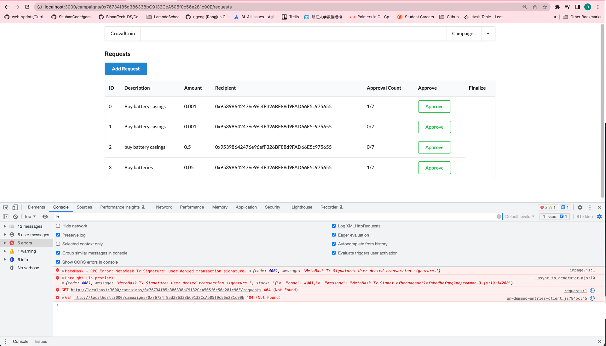

# 227. Approving a Request

**components/RequestRow.js** - Approving a Request
```
import React, { Component } from "react";
import { Button, Table } from "semantic-ui-react";
import web3 from "../ethereum/web3";
import Campaign from "../ethereum/campaign";

class RequestRow extends Component {
  onApprove = async () => {
    const campaign = Campaign(this.props.address);

    const accounts = await web3.eth.getAccounts();
    await campaign.methods.approveRequest(this.props.id).send({
      from: accounts[0],
    });
  };

  render() {
    const { Row, Cell } = Table;
    const { id, request, approversCount } = this.props;

    return (
      <Row>
        <Cell>{id}</Cell>
        <Cell>{request.description}</Cell>
        <Cell>{web3.utils.fromWei(request.value, "ether")}</Cell>
        <Cell>{request.recipient}</Cell>
        <Cell>
          {request.approvalCount}/{approversCount}
        </Cell>
        <Cell>
          <Button color="green" basic onClick={this.onApprove}>
            Approve
          </Button>
        </Cell>
      </Row>
    );
  }
}
export default RequestRow;
```

<details>
  <summary>Approving a Request - capture</summary>


---
</details>

##  Resources for this lecture

---

-   [231-approving-request.zip](https://beatlesm.s3.us-west-1.amazonaws.com/ethereum-and-solidity-complete-developer-guide/231-approving-request.zip)