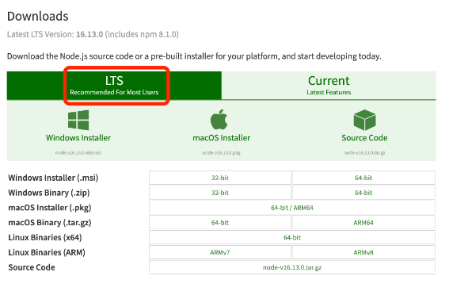

#   33. Installing Node.js, npm and Git

Starting in this section, we will begin to build and run projects in a local development environment. Please make sure you have installed the LTS (Long Term Support) version of Node.js:

https://nodejs.org/en/download/



We do not recommend installing the Current release as this often will include bugs or breaking changes that many libraries may not have fully resolved.

When you install Node.js it will automatically install **npm** which is a CLI tool that we will use frequently throughout the course.

##  Installing Git

You will also need to have Git installed on your system.

### Windows Users:

Install Git For Windows using the link below. This will also install the GitBash terminal which is helpful as it will allow you to type the same commands as shown in the lecture videos. GitBash would replace the use of the CommandPrompt or Powershell.

https://git-scm.com/download/win

### macOS Users:

Run the following command in your terminal:

```
xcode-select --install
```

If this command results in an error, you may need to install the full version of [XCode from the macOS AppStore](https://apps.apple.com/us/app/xcode/id497799835?mt=12).

### Linux (Ubuntu) Users:

In your terminal run:

```
sudo apt-get update
```

```
sudo apt-get install git
```

##  Prerequisite Information

If you've never used a terminal or code editor before these are things you'll need to get familiar with before continuing as this is a developer-focused course. Some quick tutorials that might help:

Command Line / Terminal:

https://www.youtube.com/watch?v=aKRYQsKR46I

https://developer.mozilla.org/en-US/docs/Learn/Tools_and_testing/Understanding_client-side_tools/Command_line

VSCode / Code Editor

https://www.youtube.com/watch?v=S320N3sxinE

https://www.youtube.com/watch?v=WPqXP_kLzpo


---

- [33. Installing Node.js, npm and Git](https://www.udemy.com/course/ethereum-and-solidity-the-complete-developers-guide/learn/lecture/29523901#questions)