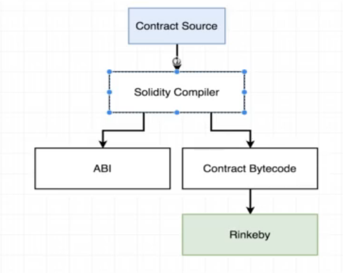

#   39. Compiling Solidity



1.  `npm init`

1.  `npm install solc@0.4.17`

1. Create compile.js
    -   `compile.js`
    ```
    const path = require("path");
    const fs = require("fs");
    const solc = require("solc");

    const inboxPath = path.resolve(__dirname, "contracts", "Inbox.sol");
    const source = fs.readFileSync(inboxPath, "utf8");

    //  console.log(solc.compile(source, 1));
    module.exports = solc.compile(source, 1).contracts[':Inbox'];
    ```

---

-   [38-compiling.zip](https://github.com/web3-nfts/bt-web3/raw/main/Curricula/developers-guide/resources/38-compiling.zip)