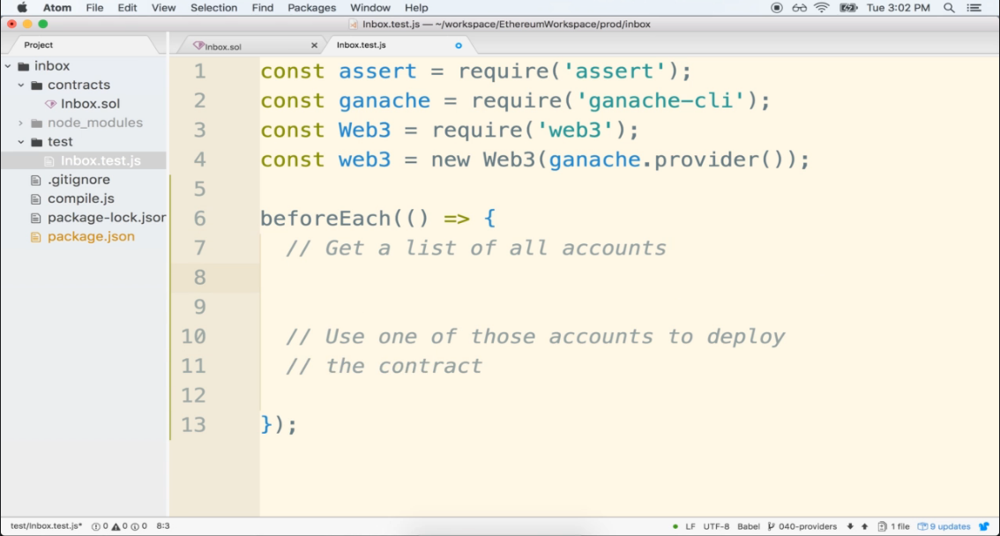
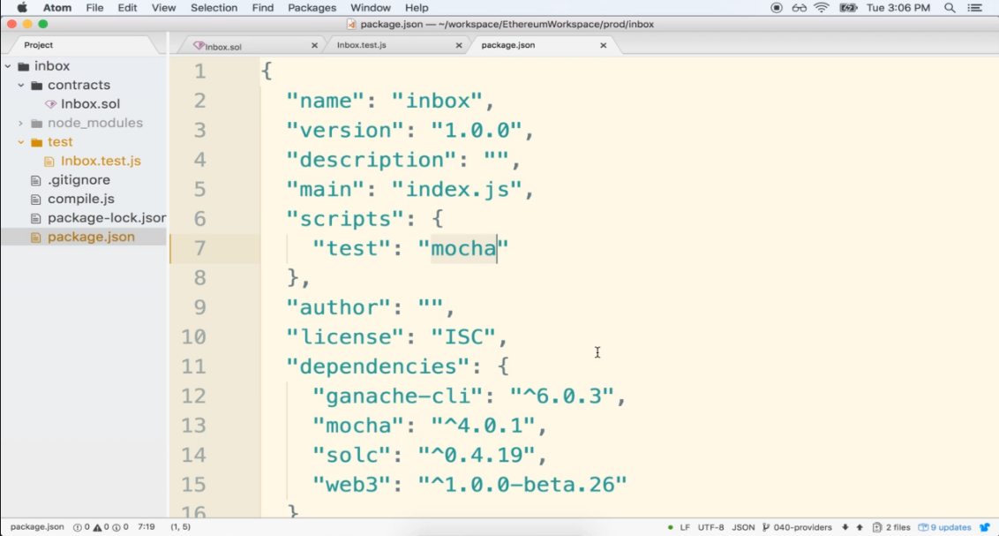
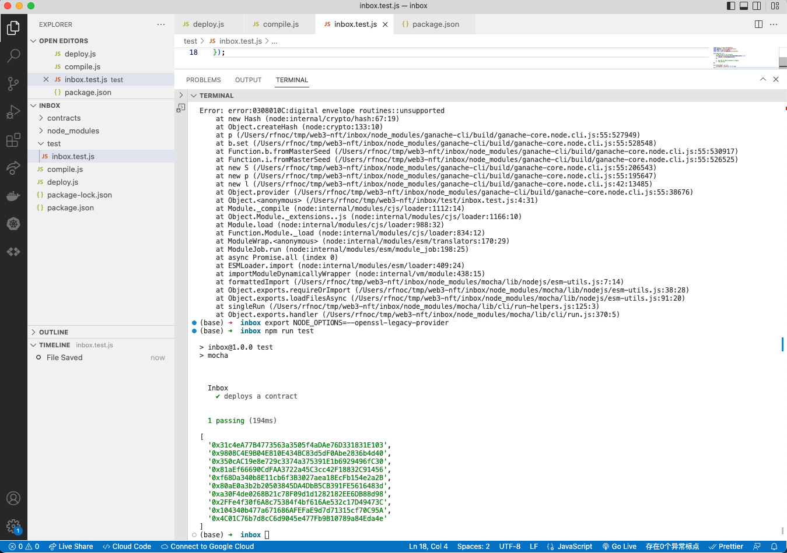

#   48. Fetching Accounts from Ganache


---

---

## **Create inbox.test.js** - Promise
-   `inbox.test.js`
    ```
    const assert = require("assert");
    const assert = require("assert");
    const ganache = require("ganache-cli");
    const Web3 = require("web3");
    const web3 = new Web3(ganache.provider());

    let accounts;

    beforeEach(async () => {
        // Get a list of all accounts
        accounts = await web3.eth.getAccounts();

        //  Use one of those accounts to deploy
        //  the contract
    });

    describe("Inbox", () => {
        it("deploys a contract", () => {
            console.log(accounts);
        });
    });
    ```
###  Testing with Mocha 

-   change the `package.json`
    ```
    "scripts": {
        "test": "echo \"Error: no test specified\" && exit 1"
    }
    ```
    to
    ```
    "scripts": {
        "test": "mocha"
    }
    ```


-   run Mocha test 
    ```
    npm run test
    ```



###  **If the following Error happen**

```
Error: error:0308010C:digital envelope routines::unsupported
    at new Hash (node:internal/crypto/hash:67:19)
    at Object.createHash (node:crypto:133:10)
    at p (/Users/rfnoc/tmp/web3-nft/inbox/node_modules/ganache-cli/build/ganache-core.node.cli.js:55:527949)
    at b.set (/Users/rfnoc/tmp/web3-nft/inbox/node_modules/ganache-cli/build/ganache-core.node.cli.js:55:528548)
    at Function.b.fromMasterSeed (/Users/rfnoc/tmp/web3-nft/inbox/node_modules/ganache-cli/build/ganache-core.node.cli.js:55:530917)
    at Function.i.fromMasterSeed (/Users/rfnoc/tmp/web3-nft/inbox/node_modules/ganache-cli/build/ganache-core.node.cli.js:55:526525)
    at new S (/Users/rfnoc/tmp/web3-nft/inbox/node_modules/ganache-cli/build/ganache-core.node.cli.js:55:206543)
    at new p (/Users/rfnoc/tmp/web3-nft/inbox/node_modules/ganache-cli/build/ganache-core.node.cli.js:55:195647)
    at new l (/Users/rfnoc/tmp/web3-nft/inbox/node_modules/ganache-cli/build/ganache-core.node.cli.js:42:13485)
  ^
```

**Open terminal and paste these as described :**

-   Linux & Mac OS (windows git bash)-
    ```
    export NODE_OPTIONS=--openssl-legacy-provider
    ```

- [Error message "error:0308010C:digital envelope routines::unsupported"](https://stackoverflow.com/questions/69692842/error-message-error0308010cdigital-envelope-routinesunsupported)

-   [48-fetching.zip](https://github.com/web3-nfts/bt-web3/raw/main/Curricula/Ethereum-and-Solidity_The_Complete_Developers_Guide/resources/48-fetching.zip)