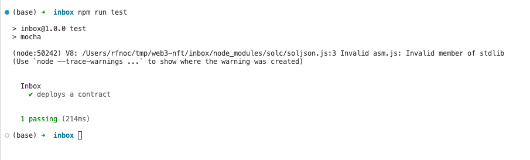
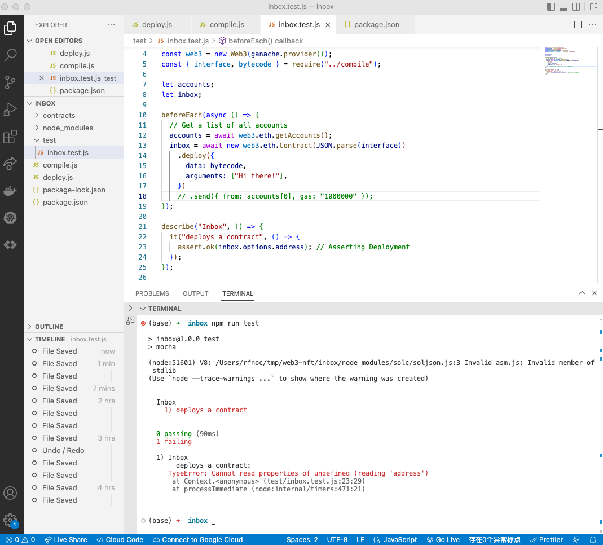

#   52. Asserting Deployment

## **Asserting Deployment** 
-   `inbox.test.js`
    ```
    const assert = require("assert");
    const ganache = require("ganache-cli");
    const Web3 = require("web3");
    const web3 = new Web3(ganache.provider());
    const { interface, bytecode } = require("../compile");

    let accounts;
    let inbox;

    beforeEach(async () => {
        // Get a list of all accounts
        accounts = await web3.eth.getAccounts();
        inbox = await new web3.eth.Contract(JSON.parse(interface))
            .deploy({
            data: bytecode,
            arguments: ["Hi there!"],
            })
            .send({ from: accounts[0], gas: "1000000" });
    });

    describe("Inbox", () => {
        it("deploys a contract", () => {
            assert.ok(inbox.options.address); // Asserting Deployment
        });
    });
    ```
##  Testing with Mocha 

-   run Mocha test 
    ```
    npm run test
    ```

<details>
  <summary>run Mocha test - result</summary>


---

---
</details>  
