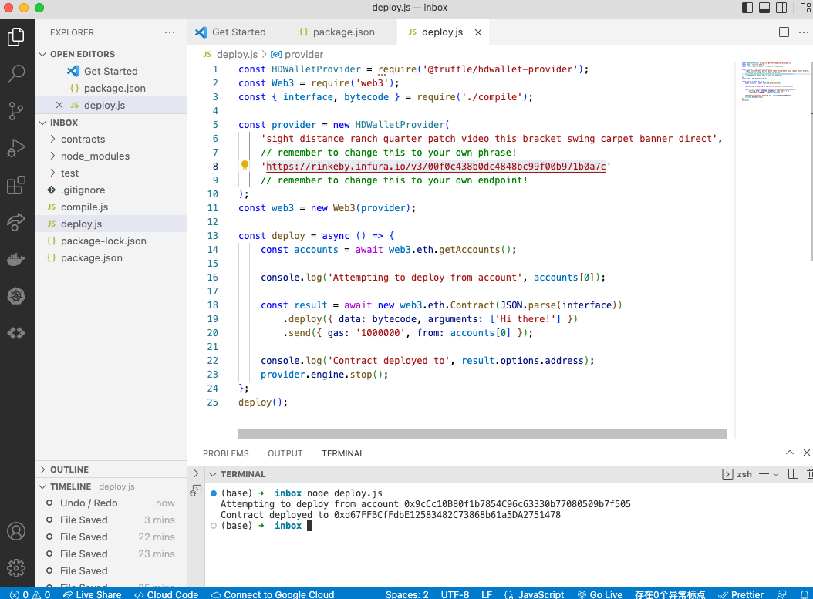

# 59. Deployment to Rinkeby

##  Deployment to Rinkeby 

-   Deployment to Rinkeby 
    ```
    node deploy.js
    ```

<details>
  <summary>Deployment to Rinkeby - result</summary>


---

---
</details>  

---

-   [61-deployment-rinkeby.zip](https://github.com/web3-nfts/bt-web3/raw/main/Curricula/Ethereum-and-Solidity_The_Complete_Developers_Guide/resources/61-deployment-rinkeby.zip)