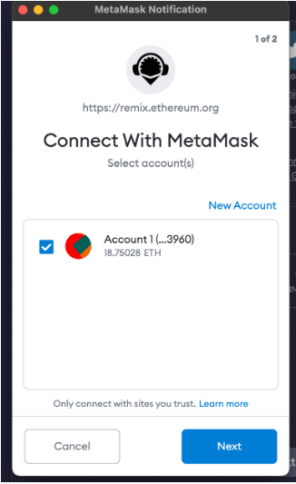
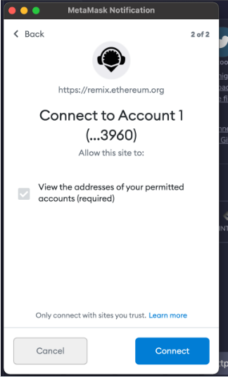
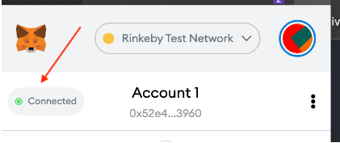

# 61. Remix Permissions and Metamask

In the upcoming lecture, we will be using the Injected Web3 provider in Remix to interact with the contract that was previously deployed.

There are few added steps along the way that you will encounter.

When switching from JavaScript VM to Injected Web3, Metamask will now require you to provide explicit permissions to connect with Remix. A popup from Metamask should appear immediately. Click the **Next** button.

 

You should then see a prompt to connect your account. Click the **Connect** button.

 

After connecting your account to Remix, you should see **Connected** with a **green circle** to the left.

 
